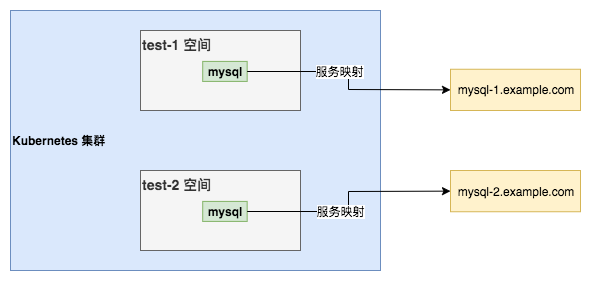

集群内的应用有时候需要调用外部的服务，我们知道集群内部服务调用都是通过 Service 互相访问，那么针对外部的服务是否也可以保持统一使用 Service 呢？

答案是肯定的，通过 Service 访问外部服务，除了方式统一以外，还能带来其他好处。如应用配置统一，可以通过 Service 映射保持两边配置统一，实现不同环境的应用通过相同 Service Name 访问不同的外部数据库。

如图 `test-1` 和 `test-2` 两个空间为两个不同的业务环境，通过服务映射，不同空间相同的 Service 访问到对应外部不同环境的数据库：



另外，还可以保证最小化变更，如果外部数据库 IP 之类的变动，只需要修改 Service 对应映射即可，服务本身配置无需变动。

<!--truncate-->

## 外部域名映射到 Service

通过 service 的 ExternalName 既可实现

```yaml
apiVersion: v1
kind: Service
metadata:
  name: mysql
spec:
  externalName: mysql.example.com
  type: ExternalName
```

创建之后，同一空间 Pod 就可以通过 mysql:3306 访问外部的 MySQL 服务。

需要注意的是，虽然 externalName 也支持填写 IP，但是并不会被 Ingress 和 CoreDNS 解析（KubeDNS 支持）。如果有 IP 相关的需求，则可以使用 Headless Service -> Type ExternalName 。另外一个需要注意的是，因为 CNAME 的缘故，如果外部的服务又经过一层代理转发，如 Nginx，除非配置对应的 server_name ，否则映射无效。

## 外部 IP 映射到 Service

前文提过，虽然 externalName 字段可以配置为 IP 地址，但是 Ingress 和 CoreDNS 并不会解析，如果外部服务为 IP 提供，那么可以使用 Headless Service 实现映射。

```yaml
apiVersion: v1
kind: Service
metadata:
  name: mysql
spec:
  clusterIP: None
  type: ClusterIP
---
apiVersion: v1
kind: Endpoints
metadata:
 name: mysql
subsets:
 - addresses:
     - ip: 192.168.1.10
```

service 不指定 selector，手动维护创建 endpoint，创建之后就可以通过 mysql:3306 访问 192.168.1.10:3306 服务的目的。Headless Service 不能修改端口相关，如果要修改访问端口，则需要进一步操作。

## 外部 IP + 端口 映射到 Service 

如果外部的端口不是标准的端口，想通过 Service 访问时候使用标准端口，如外部 MySQL 提供端口为 3307，内部想通过 Service 3306 访问，这个时候则可以通过如下方式实现：

```yaml
apiVersion: v1
kind: Service
metadata:
 name: mysql
spec:
 type: ClusterIP
 ports:
 - port: 3306
   targetPort: 3307
---
apiVersion: v1
kind: Endpoints
metadata:
 name: mysql
subsets:
 - addresses:
     - ip: 192.168.1.10
   ports:
     - port: 3307
```
service 不指定 selector，手动维护创建 endpoint，创建之后就可以通过 mysql:3306 达到访问外部 192.168.1.10:3307 服务的目的。

- 参考 [Kubernetes best practices: mapping external services](https://cloud.google.com/blog/products/gcp/kubernetes-best-practices-mapping-external-services)

## 小结

我们可以看出以上外部服务映射，externalName 和 Headless Service 方式映射外部服务是没有经过中间层代理的，都是通过 DNS 劫持实现。而有端口变更需求的时候，则要经过内部 kube-proxy 层转发。正常情况下，能尽可能少的引入中间层就少引用，特别是数据库类的应用，因为引入中间层虽然带来了便利，但也意味着可能会带来性能损耗，特别是那些对延迟比较敏感的服务。

:::tip
转载自 https://blog.opskumu.com/kubernetes-ext-service.html
:::