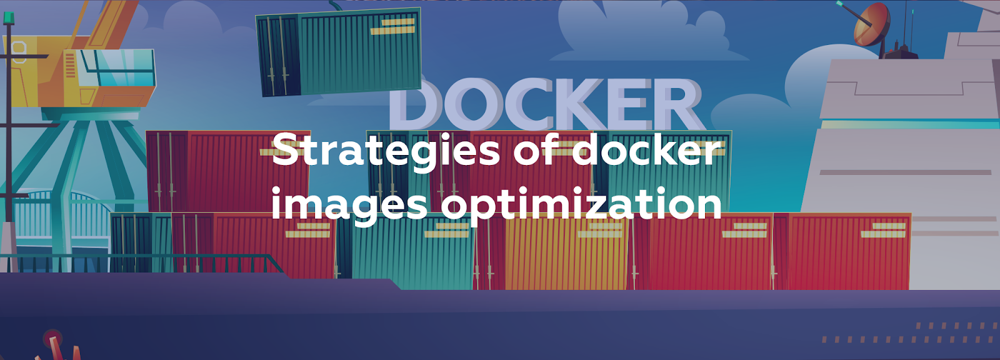
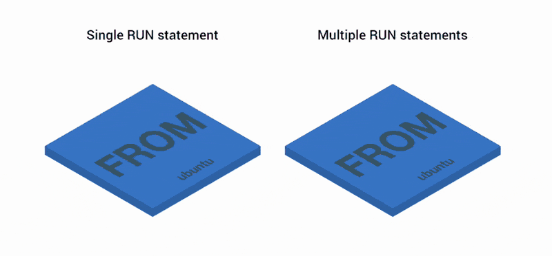
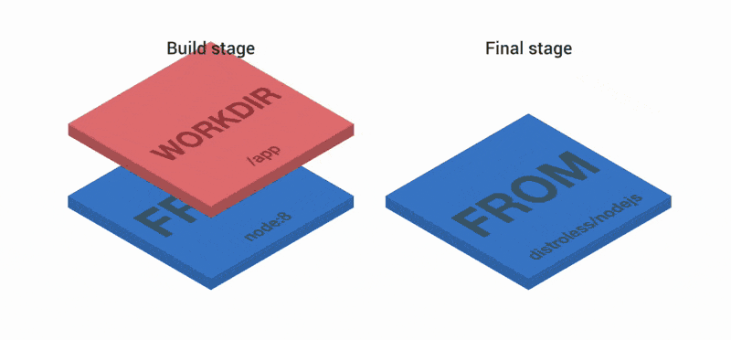

import Tabs from '@theme/Tabs';
import TabItem from '@theme/TabItem';


Java 容器镜像通常会有一个体积巨大的 JAR 包（fat-JAR）独占一个文件系统层，我们对应用程序代码所做的每一次更改都会更改该层。这是非常糟糕的，事实上这个 JAR 包含外部依赖和内部依赖，我们可以进一步通过分层来优化，充分利用分层缓存机制使其共享依赖层。

本文将通过 `解压 JAR 分层优化` 和 `Spring Boot 2.3 引入的分层索引特性` 将 JAR 分成多个层来改进这一点。
<!--truncate-->

## 先复习一下基本操作
从 Docker 1.10 开始，COPY、ADD 和 RUN 语句会向镜像中添加新层，为了缩小最终制品体积常用 Docker 的多阶段构建来进行优化。

<Tabs>
<TabItem value="一般 Dockerfile">

```dockerfile
FROM ubuntu
RUN apt-get update
RUN apt-get install vim
```

</TabItem>
<TabItem value="多阶段构建 Dockerfile">

```dockerfile
FROM node:8 as build
WORKDIR /app
COPY package.json index.js ./
RUN npm install
FROM node:8
COPY --from=build /app /
EXPOSE 3000
CMD ["index.js"]
```

</TabItem>
</Tabs>

在没有带 --no-cache=true 指令的情况下如果某一层没有改动，Docker 不会重新构建这一层而是会使用缓存
默认情况下如果第n层有改动，则n层以后的缓存都会失效，大多数情况下判断有无改动的方法是判断这层的指令和缓存中的构建指令是否一致，但是对于 COPY 和 ADD 命令会计算镜像内的文件和构建目录文件的校验和然后做比较来判断本层是否有改动。

最理想的情况下，我们希望将变化最快的东西放在最高层，并与其他应用程序共享尽可能多的大型、较低层，如 `package.json` 或者 `composer.json` 之类的包管理声明文件变动的时候会重新的安装包，在没有变动的情况下使用缓存缩短构建时间。

## 一个基础 Dockerfile

```dockerfile
FROM eclipse-temurin:17-jdk-alpine
VOLUME /tmp
ARG JAR_FILE
COPY ${JAR_FILE} app.jar
ENTRYPOINT ["java","-jar","/app.jar"]
```
您可以把 `JAR_FILE` 作为命令的一部分传递给 docker（Maven 和 Gradle 不同）。

<Tabs>
<TabItem value="Maven">

```bash
docker build --build-arg JAR_FILE=target/*.jar -t myorg/myapp .
```
</TabItem>
<TabItem value="Gradle">

```bash
docker build --build-arg JAR_FILE=build/libs/*.jar -t myorg/myapp .
```
</TabItem>
</Tabs>

如果 ENTRYPOINT 命令行有点长，您可以将其提取到 shell 脚本中，如下所示：
<Tabs>
<TabItem value="dockerfile">

```dockerfile
FROM eclipse-temurin:17-jdk-alpine
VOLUME /tmp
COPY run.sh .
COPY target/*.jar app.jar
# highlight-next-line
ENTRYPOINT ["run.sh"]
```
</TabItem>
<TabItem value="shell">

```shell
#!/bin/sh
exec java -jar /app.jar
```
:::tip
记住使用 exec 启动 java 进程（以便它可以处理KILL信号）：
:::
</TabItem>
</Tabs>

:::caution ENTRYPOINT 注意事项: 
<Tabs>
<TabItem value="exec 格式与 shell 格式">

- 使用 exec 格式 java 进程可以响应发送到容器 KILL 的信号。
- 而 shell 格式是由 "/bin/sh -e" 启动的子进程。 /bin/sh 进程 PID 为1，而被启动的进程不是 PID 不为 1 ，从而无法收到 Unix 的信号，自然不能收到从 docker stop 发来的 SIGTERM 信号。
- 像 distroless 之类的基础镜像中没有 sh 也无法使用 shell 格式。
- 扩展阅读 
  - [Dockerfile 中 ENTRYPOINT 和 CMD 的区别](/docs/Container/Docker/Dockerfile%20中%20ENTRYPOINT%20和%20CMD%20的区别)。
  - [这里有一个奇怪的现象](https://stackoverflow.com/questions/52968361/different-process-are-running-as-pid-1-when-running-cmd-entrypoint-in-shell-form)

</TabItem>
<TabItem value="ENTRYPOINT 自定义变量">

ENTRYPOINT 方便我们在运行时将环境变量注入 Java 进程。例如，假设您希望可以选择在运行时添加 Java 命令行选项。您可以尝试这样做：

<Tabs>
<TabItem value="错误示范">

```dockerfile
ENTRYPOINT  ["java","${JAVA_OPTS}","-jar","/app.jar"]
```
```bash
docker run -p 9000:9000 -e JAVA_OPTS=-Dserver.port=9000 myorg/myapp
```
这会失败，因为想要使用 `${ }` 变量需要一个 shell。exec 形式不使用 shell 来启动进程。

</TabItem>
<TabItem value="正确示范">

您可以通过将入口点移动到脚本（如run.sh前面所示的示例）或通过在 ENTRYPOINT 中创建显式 shell （ENTRYPOINT with an explicit shell）来解决这个问题，如下所示：

```dockerfile
ENTRYPOINT ["sh", "-c", "java ${JAVA_OPTS} -jar /app.jar"]
```
```bash
docker run -p 8080:8080 -e "JAVA_OPTS=-Ddebug -Xmx128m" myorg/myapp
```

</TabItem>
</Tabs>
</TabItem>
<TabItem value="自定义 ENTRYPOINT 子参数">

<Tabs>
<TabItem value="错误示范">

```dockerfile
ENTRYPOINT ["sh", "-c", "java ${JAVA_OPTS} -jar /app.jar"]
```

```bash
docker run -p 9000:9000 myorg/myapp --server.port=9000
```

它会失败，因为 `--server.port=9000` 部分被传递到 ENTRYPOINT (sh)，而不是它启动的 Java 进程。要解决此问题，您需要将命令行从 CMD 添加到 ENTRYPOINT ：

</TabItem>
<TabItem value="正确示范">

```dockerfile
FROM eclipse-temurin:17-jdk-alpine
VOLUME /tmp
ARG JAR_FILE=target/*.jar
COPY ${JAR_FILE} app.jar
ENTRYPOINT ["sh", "-c", "java ${JAVA_OPTS} -jar /app.jar ${0} ${@}"]
```
请注意`${0}`（第一个参数）和`${@}`（其余参数）的使用。如果您使用脚本作为 ENTRYPOINT，则不需要`${0}`（/app/run.sh 在前面的示例中）。

以下列表显示了脚本文件中的正确命令：

```bash
#!/bin/sh
exec java ${JAVA_OPTS} -jar /app.jar ${@}
```
</TabItem>
</Tabs>
</TabItem>
</Tabs>
:::

目前为止 docker 配置很简单，但 docker 镜像有一个包含 `fat JAR` 的文件系统层，我们对应用程序代码所做的每一次更改都会更改该层。
```dockerfile
FROM eclipse-temurin:17-jdk-alpine
VOLUME /tmp
COPY run.sh .
# highlight-next-line
COPY target/*.jar app.jar
ENTRYPOINT ["run.sh"]
```
这时我们可以利用 `解压 JAR 分层优化` 或者 `Spring Boot 2.3 引入的分层索引特性` 将 JAR 分成多个层来改进这一点。

## 一般 JAR 分层优化
由于 JAR 本身的打包方式，Spring Boot `fat JAR` 自身为一层。我们可以先解压它，将其分为外部依赖和内部依赖，使更多的层可以被缓存。以下演示解压缩 Spring Boot fat JAR：（使用 Maven 但 Gradle 版本非常相似）

```bash
mkdir target/dependency
(cd target/dependency; jar -xf ../*.jar)
docker build -t myorg/myapp .
```
然后我们可以使用下面的Dockerfile

```dockerfile
FROM eclipse-temurin:17-jdk-alpine
VOLUME /tmp
ARG DEPENDENCY=target/dependency
COPY ${DEPENDENCY}/BOOT-INF/lib /app/lib
COPY ${DEPENDENCY}/META-INF /app/META-INF
COPY ${DEPENDENCY}/BOOT-INF/classes /app
ENTRYPOINT ["java","-cp","app:app/lib/*","hello.Application"]
```
现在是三层，所有的应用资源都在后两层。如果应用程序依赖关系没有改变，第一层（from BOOT-INF/lib）不需要改变，所以构建速度更快，并且容器在运行时的启动也更快，只要基础层已经被缓存。

写成多阶段构建形式如下所示：

```dockerfile

FROM eclipse-temurin:17-jdk-alpine as build
WORKDIR /workspace/app

COPY mvnw .
COPY .mvn .mvn
COPY pom.xml .
COPY src src

RUN ./mvnw install -DskipTests
RUN mkdir -p target/dependency && (cd target/dependency; jar -xf ../*.jar)

FROM eclipse-temurin:17-jdk-alpine
VOLUME /tmp
ARG DEPENDENCY=/workspace/app/target/dependency
COPY --from=build ${DEPENDENCY}/BOOT-INF/lib /app/lib
COPY --from=build ${DEPENDENCY}/META-INF /app/META-INF
COPY --from=build ${DEPENDENCY}/BOOT-INF/classes /app
ENTRYPOINT ["java","-cp","app:app/lib/*","hello.Application"]
```
:::tip
这里示例为 hello.Application 可能与您的应用程序不同。如果你愿意，你可以用另一个 ARG 参数代替它。

您还可以将 Spring Boot fat 复制 JarLauncher 到映像中并使用它来运行应用程序。通过 JarLauncher 你将不需要指定主类，但它在启动时会有点慢。
:::

## Spring Boot 分层索引

从 Spring Boot 2.3.0 开始，在 JAR 文件中包含[层信息](https://docs.spring.io/spring-boot/docs/current/reference/htmlsingle/#features.container-images.layering)。该层信息根据应用程序构建之间更改的可能性将应用程序的各个部分分开。这可用于使 Docker 图像层更加高效。

层信息可用于将 JAR 内容提取到每个层的目录中：

```bash
mkdir target/extracted
java -Djarmode=layertools -jar target/*.jar extract --destination target/extracted
docker build -t myorg/myapp .
```
然后我们可以使用以下内容Dockerfile：

```dockerfile
FROM eclipse-temurin:17-jdk-alpine
VOLUME /tmp
ARG EXTRACTED=/workspace/app/target/extracted
COPY ${EXTRACTED}/dependencies/ ./
COPY ${EXTRACTED}/spring-boot-loader/ ./
COPY ${EXTRACTED}/snapshot-dependencies/ ./
COPY ${EXTRACTED}/application/ ./
ENTRYPOINT ["java","org.springframework.boot.loader.JarLauncher"]
```
:::tip
Spring Boot fatJarLauncher 是从 JAR 中提取到镜像中的，因此它可以用于启动应用程序而无需指定 main class。

有关使用分层功能的更多信息，请参阅[Spring Boot 文档](https://docs.spring.io/spring-boot/docs/current/reference/htmlsingle/#container-images.dockerfiles)。
:::

## 安全方面

遵循最小特权原则，进程不应以 root 权限运行，镜像应该包含运行应用程序的非根用户。

在 Dockerfile 中，您可以通过添加另一层添加系统用户和组并将其设置为当前用户（而不是默认的 root）来实现此目的：

```dockerfile
FROM eclipse-temurin:17-jdk-alpine

RUN addgroup -S demo && adduser -S demo -G demo
USER demo
```

:::tip
一些 Dockerfile 命令只能以 root 身份使用，因此您可能必须将 USER 命令向下一层移动（例如，如果您计划在容器中安装更多包，容器只能以 root 身份使用）。
<!-- 对于其他方法，不使用 Dockerfile可能更适合。例如，在稍后描述的 buildpack 方法中，大多数实现默认使用非根用户。 -->
:::

另一个考虑因素是，大多数应用程序在运行时可能不需要完整的 JDK，因此一旦我们进行了多阶段构建，我们就可以安全地切换到 JRE 基础映像。因此，在前面显示的多阶段构建中，我们可以使用最终的可运行图像：
```dockerfile
FROM eclipse-temurin:17-jre-alpine
...
```
如前所述，这也节省了图像中的一些空间，这些空间将被运行时不需要的工具占用。

## 基础镜像的选择

### alpine
前面示例中的基本图像是 eclipse-temurin:17-jdk-alpine. 这些 alpine 图像小于来自 Dockerhub eclipse-temurin 的标准库图像。


- Alpine 使用非标准的 C 库  musl libc 而不是 glibc 。muslibc 可能导致异常的 dns 解析，以及不支持 `/etc/resolv.conf` 的部分配置
- Alpine 并不比其他发行版小。 一旦你添加了任何需要的包，一个 Alpine Linux 镜像就和更主流的发行版一样大。
- Alpine 并不安全，没有为 alpine 维护的安全漏洞 (CVE) 列表，因此像 Clair (SAST) 这样的工具无法正确扫描它
- 无法使用 LXCFS 来提升容器资源可见性
- alpine 的镜像有性能问题超过 4 core 以上的应用场景，会发现 CPU 使用率上不去，原因未知,所以我们认为是 alpine 这个镜像本身，不适合 API 网关应用场景 (对性能有极致要求)
- 详情请参考以下文章
  - [Moving to Ubuntu for our Docker image](https://www.dotcms.com/blog/post/moving-to-ubuntu-for-our-docker-image)
  - [Stop using Alpine Docker images](https://medium.com/inside-sumup/stop-using-alpine-docker-images-fbf122c63010)
  - [Why it's better not to use Alpine Linux for python projects](https://megamorf.gitlab.io/2020/05/06/why-it-s-better-not-to-use-alpine-linux-for-python-projects/)
  - [不要在生产环境中使用alpine基础镜像 – 容器基础镜像的选择](https://ttys3.dev/post/do-not-use-alpine-in-production-environment/)
  - [Using Alpine can make Python Docker builds 50× slower](https://pythonspeed.com/articles/alpine-docker-python/)
    - 有一种特殊情况会同时遇到 Alpine 的绝大多数问题：将 Python 用于数据科学。numpy 和 pandas 之类的包都被预编译成了 wheel，wheel 是 Python 新的打包格式，被编译成了二进制，用于替代 Python 传统的 egg 文件，可以通过 pip 直接安装。但这些 wheel 都绑定了特定的 C 库，这就意味着在大多数使用 glibc 的镜像中都可以正常安装，但 Alpine 就不行。如果非要在 Alpine 中安装，你需要安装很多依赖，重头构建，耗时又费力。


### distroless/ubi/bazel 

distroless/ubi都可以从容器中移除所有不必要的 cruft，它们仅包含您的应用程序及其运行时依赖项。它们不包含包管理器、shell 以及您希望在标准 Linux 发行版中找到的任何其他程序。它有着更小的攻击面和更小的体积。

```dockerfile title="示例"
FROM node:8 as build
WORKDIR /app
COPY package.json index.js ./
RUN npm install
FROM gcr.io/distroless/nodejs
COPY --from=build /app /
EXPOSE 3000
CMD ["index.js"]
```

如果你要问 [GoogleCloudPlatform/distroless](https://github.com/GoogleCloudPlatform/distroless) 和 [redhat ubi](https://developers.redhat.com/products/rhel/ubi) 有什么区别呢？

那么可以参考：
- 红帽的这篇文章 [Why distroless containers aren't the security solution you think they are](https://www.redhat.com/en/blog/why-distroless-containers-arent-security-solution-you-think-they-are) 
- 和这个仓库 [raif-ahmed/ubi-vs-distroless-images](https://github.com/raif-ahmed/ubi-vs-distroless-images)

调试它们可以参考 linux 下 通过 nsenter 进入命名空间 或者 kubectl-debug 插件 或者 [kubernetes 临时容器（ephemeral-containers）](https://kubernetes.io/zh-cn/docs/concepts/workloads/pods/ephemeral-containers/)，本文不再赘述。
<!-- [Kubernetes 上调试 distroless 容器](https://atbug.com/debug-distroless-container-on-kubernetes/) -->

扩展阅读：
  - 识别应用程序运行时依赖性 [Identifying application runtime dependencies](https://unrealcontainers.com/blog/identifying-application-runtime-dependencies/#types-of-dependencies)
  - https://bazel.build/

### 选择合适的 JRE JDK

我们可以在多阶段构建的 build 阶段使用 JDK 作为基础镜像，run 阶段使用 JRE 作为基础镜像。（并非所有应用程序都可以使用 JRE（相对于 JDK），但大多数都可以。由于存在滥用某些 JDK 功能（例如编译）的风险，一些组织强制要求每个应用程序都必须使用 JRE 。）

- JRE 即 Java 运行时环境（Java Runtime Environment），包含了运行 Java 程序所需要的环境，即 JVM。
- JDK 即 Java 开发工具包（Java Development Kit），既包含了 JRE，也包含了开发 Java 程序所需的工具，即 Java 编译器。

### JLink

JLink 与 OpenJDK 11 及更高版本捆绑在一起。JLink 允许您从完整 JDK 中的模块子集构建自定义 JRE 分发，因此您不需要基础映像中的 JRE 或 JDK。这将使您获得比官方JRE/JDK图像更小的总图像大小。

缺点是自定义的 JRE 不能在其他应用程序之间共享，因为它们需要不同的自定义。因此，您的所有应用程序的图像可能都较小，但它们仍然需要更长的时间才能启动，因为它们无法从缓存 JRE 层中获益。

:::tip
目标镜像并不一定总是要建立尽可能小。较小的图像通常是一个好主意，因为在它们中的任何一个层都没有被缓存时它们上传和下载的时间较短。
由于Docker用的是overlay fs, 这个fs的魔法之处在于，base image其实你只需要pull一次，存储在磁盘上也只需要存储一次而已。
因为镜像仓库支持分层缓存，如果使用公共基础镜像你只需要缓存一次，所以镜像的总大小不太受关注。随着镜像格式和镜像分发方式的发展，如 [nydus 镜像格式](https://nydus.dev/) 和 [Dragonfly p2p 分发方案](https://d7y.io/) 镜像大小将会越来越不受关注。

尽管如此，在我们的应用镜像中尝试优化层仍然是重要的，而且是有用的。原则是将变化最快的东西放在最高层，并与其他应用程序共享尽可能多的大型、较低层。
:::

### GraalVM native-image 

在云原生大背景下，对应用要求之一是 Disposability (易处置 - 快速启动和优雅退出), 而 java-jvm 存在预热慢、冷启动慢，而且内存占用巨大，不适合 serverless 场景，这里有基于 AWS Lambda 的所有语言的冷/热启动性能对比 [AWS Lambda battle 2021: performance comparison for all languages (cold and warm start)](https://filia-aleks.medium.com/aws-lambda-battle-2021-performance-comparison-for-all-languages-c1b441005fd1)。

所以 GraalVM 推出了 [native-image](https://www.graalvm.org/22.3/reference-manual/native-image/basics/)，它可以将 Java 字节码作为输入来生成独立的二进制文件，所以不需要 JVM/GraalVM 之类 runtime，同时极大的降低了冷启动时间、内存消耗和应用体积。当然 Graalvm native-image 也是存在缺点的，比如夸张的编译时间，暂时不支持JVMTI、Java代理、JMX、JFR，不支持线程转储和堆转储等，更多请参考 [native-image 兼容性指南](https://www.graalvm.org/22.3/reference-manual/native-image/metadata/Compatibility/) 这部分提供了有关 GraalVM 限制的更多详细信息。

Spring 官方在下 2021 年 3 月 11 日 宣布了 [Spring Native Beta](https://spring.io/blog/2021/03/11/announcing-spring-native-beta) 以支持 GraalVM native-image ，
2022 年 11月24日 Spring Boot 3 正式发布，与此同时	Spring Native 被 Spring Boot 3 官方原生支持所取代 [相关参考文档](https://docs.spring.io/spring-boot/docs/current/reference/html/native-image.html)。这方便了在 Spring 中使用 GraalVM native-image 进行编译。

<!-- [java几乎所有的工具/类库，都在尝试往graal上搬？用graal做aot？](https://www.zhihu.com/question/486452665) -->

## 补充

- 如果你想尽快启动你的应用程序，你可能会考虑一些调整，参考文档：[tweaks](https://spring.io/guides/topicals/spring-boot-docker/#_tweaks) 
- 这里还有一些自动化构建插件，参考文档：[build_plugins](https://spring.io/guides/topicals/spring-boot-docker/#_build_plugins)

### Jib 插件

下面简单的介绍一个插件 GoogleContainerTools/jib 参考文档：[Jib quickstart](https://github.com/GoogleContainerTools/jib/tree/master/jib-maven-plugin#quickstart)，

Jib  可以自动帮你完成 JAR 分层以及一些其他的镜像优化。最重要的是 Jib 和 BuildKit、kaniko 一样都是 Dockerless 的，因此你不需要 docker 环境来运行它！这非常适合 CI/CD !

同时 Jib 不需要 Dockerfile（它无论如何都会被忽略）它的参数在 pom.xml 中定义，或者也可以作为参数传递给它。

以下示例在不更改的情况下使用 Maven pom.xml：

```bash
mvn com.google.cloud.tools:jib-maven-plugin:build \
-Djib.from.image=${FROM_IMAGE} \
-Djib.to.image=$CI_REGISTRY_IMAGE:$CI_COMMIT_REF_NAME-$CI_COMMIT_SHORT_SHA  \
-Djib.to.auth.username=$CI_REGISTRY_USER \
-Djib.to.auth.password=$CI_REGISTRY_PASSWORD
```

这里有一篇来自 Google 关于容器构建工具的对比文章推荐阅读 [Buildpacks vs Jib vs Dockerfile: Comparing containerization methods](https://cloud.google.com/blog/topics/developers-practitioners/comparing-containerization-methods-buildpacks-jib-and-dockerfile)

### Docker 实验功能

Docker 18.06 带有一些“实验性”功能，包括缓存构建依赖项的方法。要打开它们，您需要守护程序中的标志 ( dockerd) 和运行客户端时的环境变量。

```dockerfile
# syntax=docker/dockerfile:experimental
```
该RUN指令然后接受一个新标志：--mount。以下清单显示了一个完整的示例：

<Tabs>
<TabItem value="Maven">

```dockerfile title="Dockerfile for Maven"
# syntax=docker/dockerfile:experimental
FROM eclipse-temurin:17-jdk-alpine as build
WORKDIR /workspace/app

COPY mvnw .
COPY .mvn .mvn
COPY pom.xml .
COPY src src

RUN --mount=type=cache,target=/root/.m2 ./mvnw install -DskipTests
RUN mkdir -p target/dependency && (cd target/dependency; jar -xf ../*.jar)

FROM eclipse-temurin:17-jdk-alpine
VOLUME /tmp
ARG DEPENDENCY=/workspace/app/target/dependency
COPY --from=build ${DEPENDENCY}/BOOT-INF/lib /app/lib
COPY --from=build ${DEPENDENCY}/META-INF /app/META-INF
COPY --from=build ${DEPENDENCY}/BOOT-INF/classes /app
ENTRYPOINT ["java","-cp","app:app/lib/*","hello.Application"]
```
</TabItem>
<TabItem value="Gradle">

```dockerfile title="Dockerfile for Gradle"
# syntax=docker/dockerfile:experimental
FROM eclipse-temurin:17-jdk-alpine AS build
WORKDIR /workspace/app

COPY . /workspace/app
RUN --mount=type=cache,target=/root/.gradle ./gradlew clean build
RUN mkdir -p build/dependency && (cd build/dependency; jar -xf ../libs/*.jar)

FROM eclipse-temurin:17-jdk-alpine
VOLUME /tmp
ARG DEPENDENCY=/workspace/app/build/dependency
COPY --from=build ${DEPENDENCY}/BOOT-INF/lib /app/lib
COPY --from=build ${DEPENDENCY}/META-INF /app/META-INF
COPY --from=build ${DEPENDENCY}/BOOT-INF/classes /app
ENTRYPOINT ["java","-cp","app:app/lib/*","hello.Application"]
```
</TabItem>
</Tabs>

然后你可以运行它：
```
DOCKER_BUILDKIT=1 docker build -t myorg/myapp .

...
=> /bin/sh -c ./mvnw install -DskipTests              5.7s
=> exporting to image                                 0.0s
=> => exporting layers                                0.0s
=> => writing image sha256:3defa...
=> => naming to docker.io/myorg/myapp
```
使用实验性功能，您可以在控制台上获得不同的输出，但您可以看到 Maven 构建现在只需要几秒钟而不是几分钟，前提是缓存是热的。

:::tip
虽然这些功能处于实验阶段，但打开和关闭 buildkit 的选项取决于docker您使用的版本。检查您拥有的版本的文档（前面显示的示例适用于docker18.0.6）。
:::

<!-- ###  Go 语言镜像精简
可以参考 https://studygolang.com/articles/24209
    - 依赖库  go -- cgo
    - golang glibc 打包问题
Go 语言程序编译时会将所有必须的依赖编译到二进制文件中，但也不能完全肯定它使用的是静态链接，因为 Go 的某些包是依赖系统标准库的，例如使用到 DNS 解析的包。只要代码中导入了这些包，编译的二进制文件就需要调用到某些系统库，为了这个需求，Go 实现了一种机制叫 cgo，以允许 Go 调用 C 代码，这样编译好的二进制文件就可以调用系统库。

也就是说，如果 Go 程序使用了 net 包，就会生成一个动态的二进制文件，如果想让镜像能够正常工作，必须将需要的库文件复制到镜像中，或者直接使用 busybox:glibc 镜像。

当然，你也可以禁止 cgo，这样 Go 就不会使用系统库，使用内置的实现来替代系统库（例如使用内置的 DNS 解析器），这种情况下生成的二进制文件就是静态的。可以通过设置环境变量 CGO_ENABLED=0 来禁用 cgo，例如：

```
FROM golang
COPY whatsmyip.go .
ENV CGO_ENABLED=0
RUN go build whatsmyip.go

FROM scratch
COPY --from=0 /go/whatsmyip .
CMD ["./whatsmyip"]

```

由于编译生成的是静态二进制文件，因此可以直接跑在 scratch 镜像中 

当然，也可以不用完全禁用 cgo，可以通过 -tags 参数指定需要使用的内建库，例如 -tags netgo 就表示使用内建的 net 包，不依赖系统库：
```
$ go build -tags netgo whatsmyip.go
``` -->


## 参考文档

- [Spring Boot Docker](https://spring.io/guides/topicals/spring-boot-docker/)
- [3 simple tricks for smaller Docker images](https://itnext.io/3-simple-tricks-for-smaller-docker-images-f0d2bda17d1e)
<!-- https://blog.tiger-workshop.com/docker-difference-between-entrypoint-and-cmd/
[buildkit 多阶段并发构建](https://developer.aliyun.com/article/888404) -->