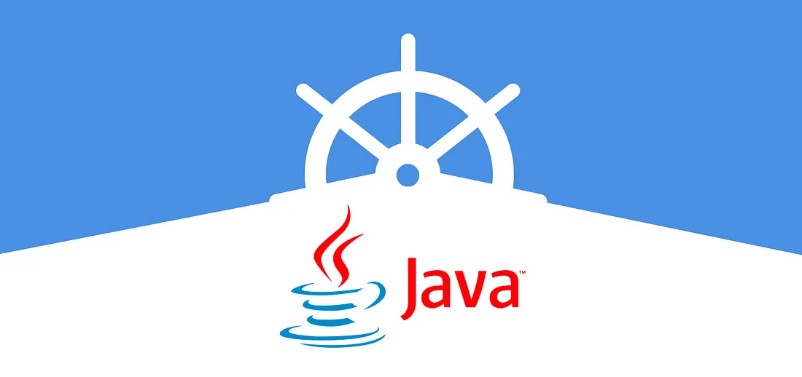
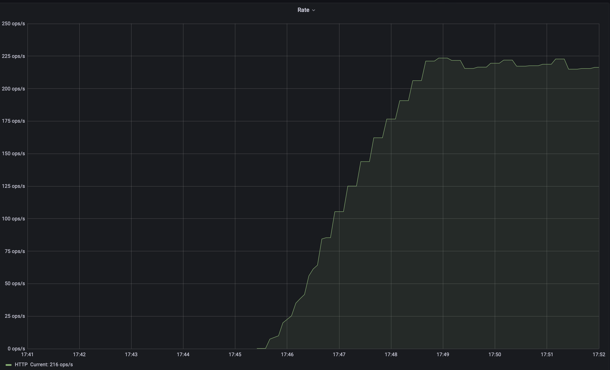

  <!-- java项目的启动加速和可观测性jvm优化，还有服务发现下沉
  maxsurge maxunavailable  java crs加速   垂直缩放
  Argo rollout 结合 Istio 实现优雅发布 蓝绿发布， jvm预热 原地垂直扩展 java优化！！！ -->


本文介绍了如何将 Spring Cloud 服务发现下沉到 Kubernetes ，同时结合 Istio 解决 JVM 预热的一些思路。
<!-- truncate -->

## 背景

在我们的生产环境中 spring 应用滚动发布时候会出现少量非200状态码，同时伴随着 cpu req 激增。

## 原因分析
JVM 在启动时往往不能立即达到其最佳性能，需要经过一段时间的“预热”才能达到最优的执行速度。

在预热阶段 JIT 编译器会将热点代码编译成本地机器码，以提高执行效率。这个阶段，如果突然接收到大量请求，将会导致CPU使用率急剧上升。这是因为：

1.  **JIT即时编译**：在预热期间，JVM需要不断地将热点代码编译成本地代码，这个过程本身就需要消耗CPU资源。
2.  **大量请求处理**：同时处理大量的请求，尤其是在代码还没有被充分优化时，会增加CPU的负担。

扩大 limit 可以缓解出现响应错误的现象，但这治标不治本。但过小的 limit 结合 HPA 容易产生 [HPA Flapping](https://kubernetes.io/docs/tasks/run-application/horizontal-pod-autoscale/#flapping) 现象，比如Java程序启动时因为JVM预热、框架初始化等原因，通常资源使用率超高。HPA就会觉得资源不足，于是再新起一个Pod，结果新起的Pod还是资源使用率超高，导致HPA不断起新Pods直到hit预设的max Pod number。

- https://medium.com/blablacar/warm-up-the-relationship-between-java-and-kubernetes-7fc5741f9a23
- https://tech.olx.com/improving-jvm-warm-up-on-kubernetes-1b27dd8ecd58

## 目的
我需要一个解决方案来预热，在 pod 准备就绪时，随着时间的推移而逐渐增加负载 pod 的 qps。

这样启动时少量的请求可以帮助 JVM 进行 JIT 编译，同时可以帮助减缓CPU的暴涨。
-   **渐进式优化**：JVM有更多的时间来识别热点代码，并进行优化编译，使得后续的请求处理更加高效。
-   **避免突然负载增加**：避免了因突然增加大量请求导致的CPU使用率急剧上升。

例如：让我希望预热时间为 120 秒。 现有 2 个 Pod 分别拥有 50% 的流量，当新的 Pod 启动时，它将处理低流量并随着时间的推移而增加，并将在 120 秒内达到 33%。

## Spring Cloud 服务发现下沉

我们的Spring Cloud框架采用的nacos服务发现机制，服务间调用会绕过Kubernetes的路由过程，流量直接定向到达目标服务的Pod IP，导致 istio 的相关策略失效，需要如下配置将其服务发现下沉到K8S中。

使用Nacos作为服务注册中心时，需配置：
```bash
spring.cloud.nacos.discovery.ip = your-service-name
```

同时需要保证服务间调用时在调用链路上透传请求头信息：

由于Spring Cloud的RibbonClient组件在发送HTTP请求时默认不会携带Istio路由所需的Host请求头[1]，开发者还需要自行添加HTTP Client的拦截器来在请求发出前添加内容为Host: 当前服务名的Header，使得请求能被Istio Sidecar处理。
- https://github.com/IBM/spring-cloud-kubernetes-with-istio/blob/master/README.md#discovery-client-and-istio

## WarmupDurationSecs自动预热

在 v1.14 之后，Istio 在目标规则中提供了预热功能（envoy 中的慢启动模式）。

对于基于 JVM 的服务来说，这是一个很棒的功能，我们计划使用它来解决 java 服务的慢启动问题。启动时少量的请求可以帮助 JVM 进行 JIT 编译，同时不会耗尽所有 cpu 资源。

[Istio DestinationRule](https://istio.io/latest/docs/reference/config/networking/destination-rule/#LoadBalancerSettings)中 LoadBalancerSettings 部分的 WarmupDurationSecs 参数可用于控制新 pod 的流量逐渐增加。当应用新版本的部署时，Istio 可以在指定的时间段内逐渐增加更新的部署到 pod 的流量。

```yaml
apiVersion: networking.istio.io/v1alpha3
kind: DestinationRule
metadata:
  name: my-service-destination-rule
spec:
  host: my-service
  trafficPolicy:
    loadBalancer:
      simple: ROUND_ROBIN
      warmupDurationSecs: 180s
  subsets:
  - name: v1
    labels:
      version: v1
  - name: v2
    labels:
      version: v2
```
因此，在 180 秒内，istio 将增加发送到 pod 的流量，增长速度几乎是线性的：


## VirtualService 优化发布策略

理想的情况是新启动的实例可以进入慢启动模式并接收流量，但旧实例应保持接收流量，直到新实例完成预热。

当服务处于慢启动模式（预热）时，它需要接收流量为 ready 状态，此时，在kubernetes滚动更新时，控制器会认为它已经准备好，去更新下一个实例，这可能会导致该服务的**所有可用实例都处于慢启动模式**。

注意这里使用perstop无法解决，因为进入perstop后 pod 也会停止接收流量，ip 会从 endpoint上摘除，控制器仍会更新下一个实例。

- https://discuss.istio.io/t/how-to-coordinate-warm-up-and-kubernetes-rolling-update/14154

这时我们可以借助 VirtualService 定义具有两条具有不同权重的路由，来进行渐进式发布：

```yaml
apiVersion: networking.istio.io/v1alpha3
kind: VirtualService
metadata:
  name: reviews
spec:
  hosts:
    - reviews
  http:
  - route:
    - destination:
        host: reviews
        subset: v1
      weight: 90
    - destination:
        host: reviews
        subset: v2
      weight: 10
```

然后可以手动流量权重来完成发布，参考[istio 文档](https://istio.io/latest/docs/tasks/traffic-management/traffic-shifting/)。

当然这不够自动化，所以我们一般会可以结合 Flagger 或者 Argo Rollouts 来实现权重的自动切换和发布回退。

<!-- ## jvm参数
- https://learn.microsoft.com/zh-cn/azure/developer/java/containers/kubernetes
- https://zhuanlan.zhihu.com/p/420992954 
- https://blog.csanchez.org/2017/05/31/running-a-jvm-in-a-container-without-getting-killed/
- -->
## 参考文章
- https://stackoverflow.com/questions/74517652/gradually-warm-java-application-in-k8s-with-istio
- https://github.com/IBM/spring-cloud-kubernetes-with-istio/blob/master/README.md#discovery-client-and-istio
- https://github.com/argoproj/argo-rollouts/issues/617


