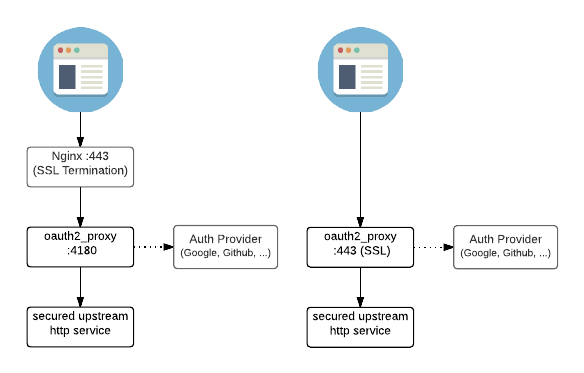
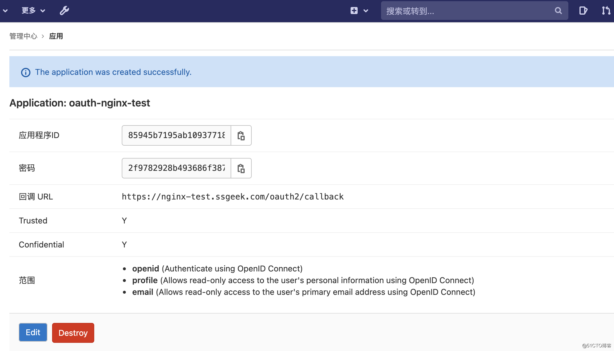
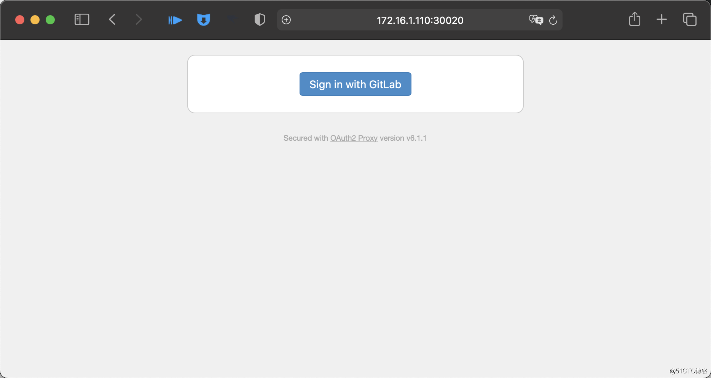
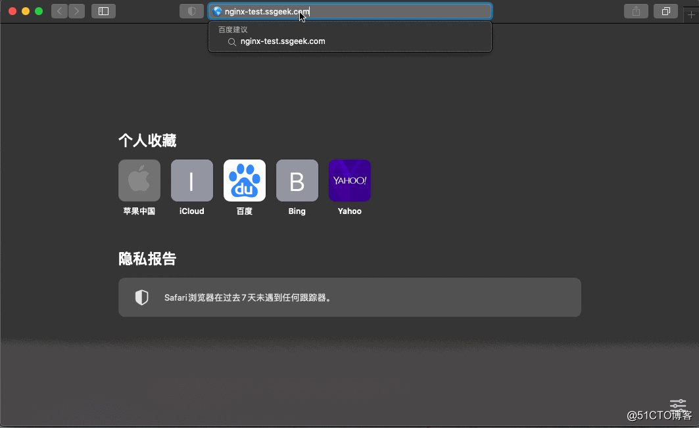

https://cloud.tencent.com/developer/article/1983889

https://www.nginx-cn.net/blog/implementing-openid-connect-authentication-kubernetes-okta-and-nginx-ingress-controller/

https://www.qikqiak.com/post/k8s-auth-via-oidc/

https://www.ssgeek.com/post/ji-yu-k8s-ingress-nginxoauth2gitlab-wu-dai-ma-qin-ru-shi-xian-zi-ding-yi-fu-wu-de-wai-bu-yan-zheng/

https://kubernetes.github.io/ingress-nginx/examples/auth/oauth-external-auth/

https://ibrahimhkoyuncu.medium.com/kubernetes-ingress-external-authentication-with-oauth2-proxy-and-keycloak-9924a3b2d34a


还有很多项目看一下安全章节，ldap-vue dashboard     proxy mudi
https://github.com/authelia/authelia

目录  

-   1、OAuth和OAuth2.0介绍
-   2、应用场景
-   3、oauth2 proxy介绍
-   4、具体实现
    -   4.1 在Gitlab配置OpenID应用
    -   4.2 生成Cookie密钥
    -   4.3 部署oauth2-proxy
    -   4.4 创建测试应用并配置Ingress
    -   4.5 测试外部认证
    -   4.6 流程分析
-   5、总结

## 1、OAuth和OAuth2.0介绍

OAuth是一种授权机制。数据的所有者告诉系统，同意授权第三方应用进入系统，获取这些数据。系统从而产生一个短期的进入令牌token，用来代替密码，供第三方应用使用。

OAuth 2.0是用于授权的行业标准协议。OAuth 2.0致力于简化客户端开发人员的工作，同时为Web应用程序，桌面应用程序，移动电话和客厅设备提供特定的授权流程。

OAuth 2.0是目前最流行的授权机制，用来授权第三方应用，获取用户数据。

## 2、应用场景

很多情况下，许多应用程序不提供内置的身份验证或开箱即用的访问控制。由于这些应用程序处理的敏感数据，这可能是一个主要问题，通常有必要提供某种类型的安全性。基于k8s部署的一些服务，并没有自身的访问认证控制机制。例如我们部署一个用于公司内部使用的web应用，又不想做基于统一账号SSO的认证功能的开发，但是又想在用户访问时加上一层认证功能。这类情况的解决思路一般是在访问入口，例如Ingress上添加一层访问认证，可以借助于basic auth实现此功能，但basic auth存在过于简单、账号权限不好控制、需要手动维护等诸多问题。

于是另外一种相对更为成功的解决办法是使Ingress通过OAuth对接到能够提供支持oauth认证的外部服务，例如github、gitlab。这种方式没有对应用程序的代码侵入，仅仅在应用入口添加了配置。

除了上述我描述的这个应用场景，还有很多可以利用oauth轻松实现认证的场景。

## 3、oauth2 proxy介绍

oauth2 proxy是一个反向代理和静态文件服务器，使用提供程序（Google，GitHub和其他提供商）提供身份验证，以通过电子邮件，域或组验证帐户。

项目地址：https://github.com/oauth2-proxy/oauth2-proxy

认证过程的流程如下



## 4、具体实现

实验环境：

-   k8s 1.15.0
-   Ingress nginx 0.25.0
-   gitlab 13.7.4

### 4.1 在Gitlab配置OpenID应用

登录到Gitlab—>管理中心—>应用，创建一个应用



参数：

-   回调URL：指GitLab在用户通过身份验证后应将其发送到的端点，对于oauth2-proxy应该是`https://<应用域名>/oauth2/callback`
-   范围：应用程序对GitLab用户配置文件的访问级别。对于大多数应用程序，选择openid，profile和email即可。

创建完应用后，会生成一对ID和密钥，这个在后面会用到。

### 4.2 生成Cookie密钥

生成Cookie密钥。该Cookie密钥作为种子字符串以产生安全的cookie。

参考官方说明，使用base64编码，可利用以下的python脚本生成字符串。

```
import secrets
import base64

print(base64.b64encode(base64.b64encode(secrets.token_bytes(16))))
```

### 4.3 部署oauth2-proxy

在k8s中部署oauth-proxy，资源清单oauth2-gitlab.yaml和相关参数说明如下。更多的配置参数，可以参考官方文档

```
apiVersion: apps/v1
kind: Deployment
metadata:
  labels:
    k8s-app: oauth2-proxy
  name: oauth2-proxy
  namespace: kube-system
spec:
  replicas: 1
  selector:
    matchLabels:
      k8s-app: oauth2-proxy
  template:
    metadata:
      labels:
        k8s-app: oauth2-proxy
    spec:
      containers:
      - name: oauth2-proxy
        image: quay.io/oauth2-proxy/oauth2-proxy:latest
        imagePullPolicy: IfNotPresent
        ports:
        - containerPort: 4180
          protocol: TCP
        args:
        # OAuth提供者
        - --provider=gitlab
        # 上游端点的http网址
        - --upstream=file:///dev/null
        # 对具有指定域的电子邮件进行身份验证，可以多次给出，使用*验证任何电子邮件
        - --email-domain=*
        # 监听的地址
        - --http-address=0.0.0.0:4180
        # 设置安全（仅HTTPS）cookie标志
        - --cookie-secure=false
        # OAuth重定向URL
        - --redirect-url=https://nginx-test.ssgeek.com/oauth2/callback
        # 跳过登录页面直接进入下一步
        - --skip-provider-button=false
        # 设置X-Auth-Request-User，X-Auth-Request-Email和X-Auth-Request-Preferred-Username响应头（在Nginx auth_request模式下有用）。与结合使用时--pass-access-token，会将X-Auth-Request-Access-Token添加到响应标头中
        - --set-xauthrequest=true
        # 跳过OPTIONS请求的身份验证
        - --skip-auth-preflight=false
        # 绕过OIDC端点发现
        - --skip-oidc-discovery
        # OpenID Connect发行者url，这里是gitlab的url
        - --oidc-issuer-url=https://gitlab.ssgeek.com
        # 认证url
        - --login-url=https://gitlab.ssgeek.com/oauth/authorize
        # token url
        - --redeem-url=https://gitlab.ssgeek.com/oauth/token
        # 用于令牌验证的url
        - --oidc-jwks-url=https://gitlab.ssgeek.com/oauth/discovery/keys
        env:
        - name: OAUTH2_PROXY_CLIENT_ID
          value: '85945b7195ab109377183837b9221bd299bc64b31fe272304a1c777e8e241d83'
        - name: OAUTH2_PROXY_CLIENT_SECRET
          value: '2f9782928b493686f387d18db9138e92607448cef045c81319967cc3e5ce4ba1'
         # 安全cookie的种子字符串，可通过python脚本生成
        - name: OAUTH2_PROXY_COOKIE_SECRET
          value: 'VGlYNVBVOGw4UFgyRURzbERxVTRiZz09'

---
apiVersion: v1
kind: Service
metadata:
  labels:
    k8s-app: oauth2-proxy
  name: oauth2-proxy
  namespace: kube-system
spec:
  type: NodePort
  ports:
  - name: http
    port: 4180
    protocol: TCP
    targetPort: 4180
    nodePort: 30020
  selector:
    k8s-app: oauth2-proxy
```

应用上面的资源清单，创建deployment和service

```
$ kubectl apply -f oauth2-gitlab.yaml
$ kubectl -n kube-system get pods -l k8s-app=oauth2-proxy 
NAME                           READY   STATUS    RESTARTS   AGE
oauth2-proxy-884695869-bkwns   1/1     Running   0          113s
```

上面通过nodeport单独暴露了oauth2-proxy应用，可以访问检查以确保浏览器可以正常打开



### 4.4 创建测试应用并配置Ingress

资源清单文件nginx.yaml如下，其中为该nginx应用配置了https证书

```
apiVersion: extensions/v1beta1
kind: Deployment
metadata:
  name: nginx
  namespace: kube-system
spec:
  replicas: 1
  selector:
    matchLabels:
      app: nginx
  template:
    metadata:
      labels:
        app: nginx
    spec:
      containers:
      - image: nginx:1.15
        imagePullPolicy: IfNotPresent
        name: nginx

---
apiVersion: v1
kind: Service
metadata:
  name: nginx
  namespace: kube-system
spec:
  selector:
    app: nginx
  ports:
  - name: nginx
    port: 80
    targetPort: 80

---
apiVersion: extensions/v1beta1
kind: Ingress
metadata:
  name: nginx
  namespace: kube-system
  annotations:
    kubernetes.io/ingress.class: "nginx"
    nginx.ingress.kubernetes.io/rewrite-target: /
    # 指定外部认证url
    nginx.ingress.kubernetes.io/auth-url: "https://$host/oauth2/auth"
    # 指定外部认证重定向的地址
    nginx.ingress.kubernetes.io/auth-signin: "https://$host/oauth2/start?rd=$escaped_request_uri"
    nginx.ingress.kubernetes.io/force-ssl-redirect: "true"
    nginx.ingress.kubernetes.io/secure-backends: "true"
    nginx.ingress.kubernetes.io/ssl-passthrough: "true"
    nginx.ingress.kubernetes.io/ssl-redirect: "true"
spec:
  tls:
  - hosts:
    - nginx-test.ssgeek.com
    secretName: nginx-test
  rules:
    - host: nginx-test.ssgeek.com
      http:
        paths:
        - path: /
          backend:
            serviceName: nginx
            servicePort: 80

---
apiVersion: extensions/v1beta1
kind: Ingress
metadata:
  annotations:
    kubernetes.io/ingress.class: "nginx"
    # 将nginx应用的访问请求跳转到oauth2-proxy组件url
    nginx.ingress.kubernetes.io/rewrite-target: "/oauth2"
    nginx.ingress.kubernetes.io/force-ssl-redirect: "true"
    nginx.ingress.kubernetes.io/secure-backends: "true"
    nginx.ingress.kubernetes.io/ssl-passthrough: "true"
    nginx.ingress.kubernetes.io/ssl-redirect: "true"
  name: nginx-oauth2
  namespace: kube-system
spec:
  tls:
  - hosts:
    - nginx-test.ssgeek.com
    secretName: nginx-test
  rules:
  - host: nginx-test.ssgeek.com
    http:
      paths:
      - path: /oauth2
        backend:
          serviceName: oauth2-proxy
          servicePort: 4180
```

应用上面的资源清单，创建相应资源

```
$ kubectl apply -f other/nginx.yaml
deployment.extensions/nginx unchanged
service/nginx unchanged
ingress.extensions/nginx unchanged
ingress.extensions/nginx-oauth2 unchanged
$ kubectl -n kube-system get po,svc,ing |grep nginx                        
pod/nginx-5ddcc6cb74-rnjlx                    1/1     Running   0          3m

service/nginx                     ClusterIP   10.68.199.62    <none>        80/TCP                      3m

ingress.extensions/nginx               nginx-test.ssgeek.com             80, 443   3m
ingress.extensions/nginx-oauth2        nginx-test.ssgeek.com             80, 443   3m
```

### 4.5 测试外部认证

通过访问上面部署的nginx应用，在浏览器中进行测试，会被重定向到Gitlab登录页面；

输入账号，正确登录后，会被重定向回nginx应用。



### 4.6 流程分析

在请求登录外部认证的过程中查看oauth2-proxy的日志如下

```
172.16.1.110:49976 - - [2021/01/23 17:28:23] nginx-test.ssgeek.com GET - "/oauth2/auth" HTTP/1.1 "Mozilla/5.0 (Macintosh; Intel Mac OS X 10_15_6) AppleWebKit/605.1.15 (KHTML, like Gecko) Version/14.0.2 Safari/605.1.15" 401 21 0.000
172.16.1.110:9991 - - [2021/01/23 17:28:23] nginx-test.ssgeek.com GET - "/oauth2/start?rd=%2F" HTTP/1.1 "Mozilla/5.0 (Macintosh; Intel Mac OS X 10_15_6) AppleWebKit/605.1.15 (KHTML, like Gecko) Version/14.0.2 Safari/605.1.15" 302 341 0.000
172.16.1.110:9991 - admin@example.com [2021/01/23 17:28:32] [AuthSuccess] Authenticated via OAuth2: Session{email:admin@example.com user:root PreferredUsername: token:true id_token:true created:2021-01-23 17:28:32.440915913 +0000 UTC m=+2248.944621207 expires:2021-01-23 17:30:32 +0000 UTC refresh_token:true}
172.16.1.110:9991 - - [2021/01/23 17:28:32] nginx-test.ssgeek.com GET - "/oauth2/callback?code=9b7f5425d48a41f213065a4ff5b3d20d76e6d241ba753c5cd63d1a405f48818e&state=5d868b96b1f539a28da2291404152b7c%3A%2F" HTTP/1.1 "Mozilla/5.0 (Macintosh; Intel Mac OS X 10_15_6) AppleWebKit/605.1.15 (KHTML, like Gecko) Version/14.0.2 Safari/605.1.15" 302 24 0.381
172.16.1.110:5610 - admin@example.com [2021/01/23 17:28:32] nginx-test.ssgeek.com GET - "/oauth2/auth" HTTP/1.1 "Mozilla/5.0 (Macintosh; Intel Mac OS X 10_15_6) AppleWebKit/605.1.15 (KHTML, like Gecko) Version/14.0.2 Safari/605.1.15" 202 0 0.000
```

-   访问nginx应用的时候，Ingress nginx controller 会向定义的auth-url发起认证，该认证由Ingress nginx controller 发起，所以Ingress nginx controller 对应的pod必须能够访问auth-url。
    
-   如果认证没有通过，Ingress nginx controller 将客户端重定向到auth-signin。auth-signin是目标应用的 oauth2登录页面即oauth2-proxy。
    
-   客户端被重定向到oauth2登录页面后，自动进入Gitlab的登录页面，
    
    用户登录Gitlab后，Gitlab再将客户端重定向到在Gitlab中配置的应用回调地址。
    
-   客户端访问回调地址后，oauth2\_proxy在客户端设置cookie，并将客户端重定向到最初的访问地址。
    
-   带有cookie的客户端再次访问目标应用时，通过了auth-url的认证，成功访问到目标服务即nginx应用。
    

## 5、总结

本文以基于k8s部署的nginx服务为例，记录如何通过ingress和oauth2 proxy对接gitlab实现对应用没有代码侵入的外部认证。

最后，还要提到的一点是，我这里一开始使用的Gitlab是已有的10.8.4版本，调试了关于Oauth2-proxy的很多参数一直不成功，也没有找到解决办法，但是按照官方的配置与github对接时却没有报任何异常。最终通过提交issue得到了可能原因，即Gitlab的API版本可能不兼容，oauth2-proxy的开发测试成功版本的Gitlab在12.x版本以上。详情可参考我提交的issue。

See you ~

声明：本文内容由脉脉用户自发贡献，部分内容可能整编自互联网，版权归原作者所有，脉脉不拥有其著作权，亦不承担相应法律责任。如果您发现有涉嫌抄袭的内容，请发邮件至maimai@taou.com，一经查实，将立刻删除涉嫌侵权内容。