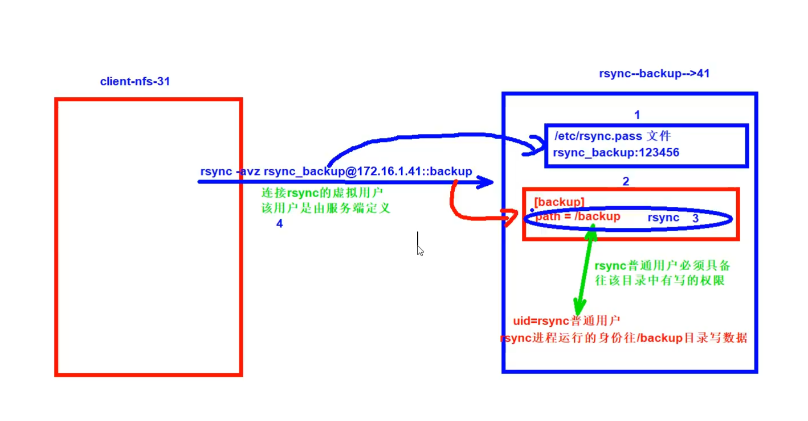

[rsync](https://rsync.samba.org/)是一款开源备份工具，监听端口：873，可在不同主机间进行同步，可实现全量/增量备份，适用于架构集中式备份或异地备份。

## Rsync 服务安装

```bash
# yum install rsync -y
# rpm -qc rsync
/etc/rsyncd.conf
/etc/sysconfig/rsyncd
# rpm -ql rsync |grep service
/usr/lib/systemd/system/rsyncd.service
/usr/lib/systemd/system/rsyncd@.service

安装rsync会自动创建一个nobody用户，用于进程启动 `useradd rsync -M -s /sbin/nologin`
```

### 创建备份文件目录

```bash
mkdir /backup
chown -R rsync:rsync /backup/
# install -d -m 0755 -o <免密账号> -g <免密账号组> ${mysqlpaas_dir}
```

### 创建虚拟用户密码文件

```bash
openssl rand -base64 12

echo "rsync_backup:123456" >/etc/rsyncd.passwd
chmod 600 /etc/rsyncd.passwd

# echo "rsync_backup:123456" | install -m 600 /dev/stdin /etc/rsyncd.passwd

```

### 配置文件详解

```bash
vi  /etc/rsyncd.conf
uid = rsync							# 运行进程的用户 默认nobody
gid = rsync							# 运行进程的用户组 默认nobody
port = 873							# 监听端口
fake super = yes					# 无需让rsync以root身份运行，允许接受文件的完整属性
use chroot = no						# 禁锢推送的数据至某个目录，不允许跳出该目录
max connections = 200				# 最大连接数
timeout = 900						# 超时时间
ignore errors						# 忽略错误信息
read only = false					# 对备份数据可写
list = true							# 允许查看模块信息	
auth users = rsync_backup			# 定义虚拟用户，作为连接认证用户
secrets file = /etc/rsyncd.passwd	# 定义虚拟用户密码文件存放路径
log file = /var/log/rsyncd.log		# 定义日志路径
[backup]			# 定义模块
comment = commit	# 模块注释信息
path = /backup		# 定义接收备份数据目录
```

### 启动服务

```bash
[root@node1 ~]# systemctl start rsyncd.service
```

### 客户端测试

```
rsync -avz   /opt rsync_backup@10.50.1.101::backup
```

### 流程图

:::caution 注意事项
- rsync_backup：客户端通过该虚拟用户链接rsync服务，由配置文件中【auth users】定义。虚拟用户密码文件由【secrets file】定义
- rsync：模块对应的目录，必须授权为配置文件中定义的UID和GID的用户
:::


## 自动备份实践脚本

**客户端需求**
1,客户端提前准备存放的备份的目录，目录规则如下/backup/nfs_172.16.1.31_2818-69-02
2.客户端在本地打包备份系统配置文件、应用配置等拷贝至/backup/nfs_172.16.1.31_2818-89-82
3.客户端最后将备份的数据进行推送至备份服务器
4.客户端每天凌晨1点定时执行该脚本
5.客户端服务器本地保留最近7天的数据，避免浪费磁盘空间
**服务端需求**
1.服务端部署Syc,用于接收客户端推送过来的备份数据
2.服务端需要每天校验客户端推送过来的数据是否完整
3.服务端需要每天校验的结果通知给管理员
4.服务端仅保留6个月的备份数据其余的全部删除
注意：所有服务器的备份目录必须都为backup

### 客户端推送脚本

```bash
#!/bin/bash
PATH=/usr/local/sbin:/usr/local/bin:/usr/sbin:/usr/bin:/root/bin
# 定义变量
## 网卡名
NET_DEV=ens33
# hostname -I
IP=$(ip addr show ${NET_DEV}|awk 'NR==3 {print $2}'|awk 'BEGIN{FS="/"} {print $1}')
HOST=$(hostname)
DATE=$(date +%F\|%H:%M:%S)
DEST=${HOST}_${IP}_${DATE}

## 本地备份目录
LOCAL_DIR="/backup"
## rsync参数
export RSYNC_PASSWORD=123456
RSYNC_USER="rsync_backup"
RSYNC_IP="10.50.1.101"
RSYNC_MOD="backup"
###########################################

## 需要备份打包在一起的文件、文件夹
SRC1="/etc/fstab /var/spool/cron"
## 备份描述
SRC1_describe="fstab_cron"
## 打包文件名
TAR_1="${LOCAL_DIR}/${SRC1_describe}_$DEST.tar.gz"
## 可创建多个,须在# 本地备份和# 推送到备份服务器手动添加条目。
SRC2="/etc/passwd"
SRC2_describe="passwd"
TAR_2="${LOCAL_DIR}/${SRC2_describe}_$DEST.tar.gz"

##########################################################
# 本地备份
[ -d ${LOCAL_DIR} ] || mkdir -pv ${LOCAL_DIR}
#/usr/bin/cp -ar $SRC  /backup/$DEST

##[可按需添加]##
/usr/bin/tar czPf ${TAR_1} $SRC2
/usr/bin/tar czPf ${TAR_2} $SRC2
##......##

# md5校验
md5sum ${TAR_1} ${TAR_2} > ${LOCAL_DIR}/md5_$DEST
/usr/bin/cp ${LOCAL_DIR}/md5_$DEST  ${LOCAL_DIR}/The_latest_md5

# 推送到备份服务器
rsync -avz ${LOCAL_DIR}/{md5_$DEST,The_latest_md5} ${RSYNC_USER}@${RSYNC_IP}::${RSYNC_MOD}

##[可按需添加]##
rsync -avz ${TAR_1}  ${RSYNC_USER}@${RSYNC_IP}::${RSYNC_MOD}
rsync -avz ${TAR_2}  ${RSYNC_USER}@${RSYNC_IP}::${RSYNC_MOD}
##......##

# 保留本地最近七天数据
#find ${LOCAL_DIR}/ -type d
find ${LOCAL_DIR}/ -type f -mtime +7|xargs rm -rf

```

### 服务端邮件服务配置

**安装mailx**

```bash
yum install mailx -y
```

**编辑配置文件**

```bash
cat /etc/mail.rc
set from=XXXXXX@qq.com
set smtp=smtps://smtp.qq.com:465
set smtp-auth-user=XXXXXX@qq.com
set smtp-auth-password=授权码(qq邮箱-设置-账户-开启SMTP等服务-获取授权码)
set smtp-auth=login
set ssl-verify=ignore
set nss-config-dir=/etc/pki/nssdb/
```

**测试**

```
mail -s "主题" XXXXXX@qq.com 内容
```

### 服务端校验脚本

```bash
#!/bin/bash
PATH=/usr/local/sbin:/usr/local/bin:/usr/sbin:/usr/bin:/root/bin
# 本地备份目录
LOCAL_DIR="/backup"
DATE=$(date +%F)
# md5 check
md5sum -c ${LOCAL_DIR}/The_latest_md5 > ${LOCAL_DIR}/result_${DATE}
# send mail
mail -s "Rsync Backup ${DATE}" 0000000@qq.com < ${LOCAL_DIR}/result_${DATE}
# 保留最近180天
find  ${LOCAL_DIR}/ -type f -mtime +180|xargs rm -rf
```

### 测试脚本

批量修改时间并执行脚本

```
for i in {1..30};do date -s 2021/01/$i;sh /server/scripts/client_push.sh ;done

sh /server/scripts/server_check.sh 
```

### 配置客户端与服务端的定时服务

```bash
crontab -e
# 客户端
0 1 * * *  /bin/bash sh /server/scripts/client_push.sh  &>/dev/null
# 服务端
0 2 * * *  /bin/bash /server/scripts/server_check.sh  &>/dev/null
# 查看
crontab -l
```