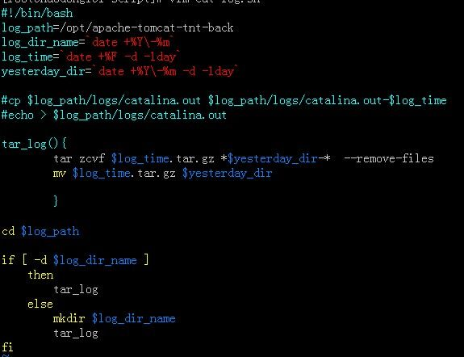
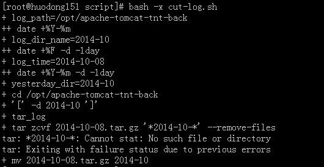

http://bbs.chinaunix.net/forum.php?mod=viewthread&tid=4156672


其中我定义的函数中，tar 命令那行手动执行是成功的。
但是放到脚本中执行的时候，脚本自动添加了单引号：如下

如果去掉单引号，tar zcvf 2014-10-08.tar.gz *2014-10-* --remove-files  这样执行是成功的，
求科普怎么解决？



```bash
通配符被禁了?这样

set +o noglob
```

```bash
暂时解决了。
file_name=`eval ls *$yesterday_dir-*`
tar_log(){
        tar zcvf $log_time.tar.gz $file_name  --remove-files
        mv $log_time.tar.gz $yesterday_dir
        }

添加了file_name变量，使用eval就好了。如果不适用eval，file_name也是会报错的。
```

```bash
这个要从shell的执行流程说起。举例如下
$ vim test.sh
  1 #!/bin/sh -x
  2 cmd='find ./ -name "*.js"'
  3 $cmd | grep "123"
$ ./test.sh  
+ cmd='find ./ -name "*.js"'
+ grep 123
+ find ./ -name '"*.js"'
shell执行步骤 $cmd | grep "123"
1. 单词分割（认识元字符） 命令被分割成
    $cmd  和 grep "123"
    先执行grep "123" 等待屏幕输出
2. 变量扩展 $cmd 变成 find ./ -name "*.js"
3. 单词分割（进分割扩展部分，且不认识元字符）后
    find ./ -name ’"*.js"‘
    shell单词分割会自动加上''(命令和-arg 等除外)
4. 路径扩展：这步会扩展统配符。包含 *、?和[。对我的命令无影响
  如果cmd='find ./ -name *.js' ,那么这步就会在当前目录下找所有js文件，若当前目录有1.js 2.js
   则这步过被扩展为 find ./ -name ’1.js’  ’2.js' 很显然无法执行
5. 引号移除   find ./ -name "*.js" （移除所有的非扩展结果的引用字符，这里是单引号''）
6. 执行指令 find ./ -name "*.js"  （注意这里匹配所有"*.js" 包括双引号）
注意：  eval $cmd | grep "123" 等同 find ./ -name "*.js"  | grep "123"
             eval会使命令扩展两次。第二次会从流程头部开始一次。
```


