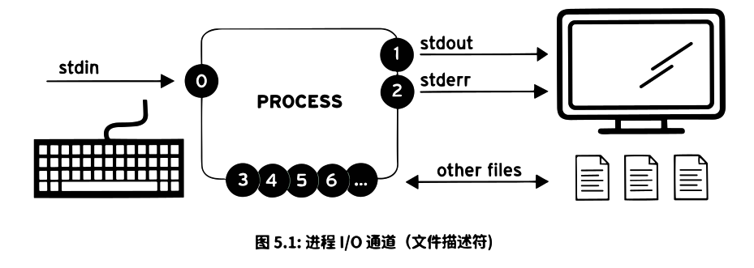

学完本节后，您应能够通过 shll 重定向将输出或错误保存到文件中，并利用管道通过多个程序处理命令输出。

## 标准输入、标准输出和标准错误

进程使用称为"文件描述符"的编号通道来获取输入并发送输出。所有进程在开始时至少要有三个文件描述符:



通道（文件描述符）

| 编号 | 通道名称 | 描述     | 默认连接 | 用法          |
| ---- | -------- | -------- | -------- | ------------- |
| 0    | stdin    | 标准输入 | 键盘     | 仅读取        |
| 1    | stdout   | 标准输出 | 终端     | 仅写入        |
| 2    | stderr   | 标准错误 | 终端     | 仅写入        |
| 3+   | filename | 其他文件 | 无       | 读取和/或写入 |

## 将输出重定向到文件
/O重定向可更改进程获取其输入或输出的方式。该进程并不是从键盘获取输入，也不是将输出和
错误发送到终端，而是执行文件读取或写入。重定向允许您将消息保存到通常发送给终端窗口的文
件中。或者，您也可以使用重定向来丢弃输出或错误，这样它们就不会显示在终端上或保存下来。
重定向stdout可以阻止进程输出显示在终端上。如下表所示，仅重定向stdout不会阻止
stderr错误消息显示在终端上。如果文件不存在，则会创建文件。如果文件确实存在，但是所需
的重定向没有附加到文件，则该文件的内容将被覆盖。


如果想丢弃消息，特殊文件/dev/nu11以静默方式丢弃重定向到其自身的通道输出，并且始终是
空文件。


**输出重定向操作符**


:::caution
重要
重定向操作的顺序非常重要。以下序列将标准输出重定向到f11e,然后将标准错误
作为标准输出重定向到相同位置（仟i1e)。
>fi1e2>&1
但是，下一个序列以相反的顺序执行重定向。这会将标准错误重定向到标准输出的默
认位置（终端窗口，因此没有任何更改），然后仅将标准输出重定向到f11e。
2>&1>fi1e
因此，有些人更倾向于使用合并重定向运算符：
&>file
而不是
>fi1e2>&1
&>>f11e
而不是
>>f11e2>&1
(在Bash4/RHEL6和更高版本中)
但是，某些系统管理员和程序员也会使用与bash相关的其他shel(称为“兼容
Bourne的shell'”)对命令进行脚本编制，这些人认为应避免使用较新的合并重定向
运算符，因为这些运算符并没有标准化，也没有在所有这些shl中实施，而且还存
在其他限制因素。
本课程的作者对该主题采取中立立场，因此您可能会在课程中遇到这两种语法。
:::


## 构建管道
管道是一个或多个命令的序列，用竖线字符()分隔。管道将第一个命令的标准输出连接到下一个命
令的标准输入。


在某个进程输出到终端之前，管道允许另一个进程操作和格式化该进程的输出。为便于理解，可以
这样想象一下：数据正在通过管道从一个进程“流”向另一个进程，并且在其流过的管道中每个命
令都会略微对其做些改动。
:::caution 注意
管道和/O重定向都可以操作标准输出和标准输入。重定向会向文件发送标准输出或
从文件获取标准输入。管道会将一个进程的标准输出发送到另一个进程的标准输入。
:::
## 管道示例
本示例取1s命令的输出并使用1ess在终端上以一次一屏的方式显示输出。
[user@host ~]1s -1 /usr/bin less
1s命令的输出传送到wc-1,用于统计从1s收到的行数并将该行数显示在终端。
RH124-L8.0-zhcn-1-20190531
123
章5|创建、查看和编辑文本文件
[user@host -]1s I wc -1
在此管道中，head将输出1s-t输出内容的前10行，并且最终结果会重定向到一个文件。
[user@host ~]1s -t head -n 10 >/tmp/ten-last-changed-files
## 输出重定向示例
通过重定向，可以简化许多日常管理任务。在思考下列示例时，请参考前面的表格：
·保存时间戳以供日后参考。
[user@host -]date /tmp/saved-timestamp
·将一个日志文件的最后100行复制到另一文件。
[user@host -]tail -n 100 /var/log/dmesg >/tmp/last-100-boot-messages
·将四个文件连接为一个。
[user@host ~]cat file1 file2 file3 file4 /tmp/all-four-in-one
·将主目录的隐藏文件名和常规文件名列出到文件中。
[user@host -]ls -a /tmp/my-file-names
·将输出附加到现有文件。
[user@host ~]echo "new line of information">>/tmp/many-lines-of-information
[user@host -]diff previous-file current-file >>/tmp/tracking-changes-made

·接下来的几个命令会生成错误消息，因为普通用户无法访问某些系统目录。观察错误消息如何被
重定向。在终端上查看普通命令输出时，将错误重定向到文件。
[user@host ~]find /etc -name passwd 2>/tmp/errors
·将进程输出和错误消息保存到单独的文件中。
[user@host -]find /etc -name passwd /tmp/output 2>/tmp/errors
·忽略并丢弃错误消息。
[user@host -]find /etc -name passwd /tmp/output 2>/dev/null
·将输出和生成的错误消息存储在一起。
[user@host -]find /etc -name passwd &>/tmp/save-both
·将输出和生成的错误附加到现有文件。
[user@host -]find /etc -name passwd >>/tmp/save-both 2>&1
## 管道、重定向和tee命令
当重定向与管道组合时，shll会首先设置整个管道，然后重定向输入/输出。如果在管道的中间使
用了输出重定向，则输出将转至文件，而不是前往管道中的下一个命令。
在本示例中，1s命令的输出将转至文件，并且1ess不会在终端上显示任何内容。
[user@host -]1s /tmp/saved-output less
tee命令克服了这个限制。在管道中，tee将其标准输入复制到其标准输出中，并且还将标准输出
重定向到指定为命令参数的文件。如果您将数据想象成流经管道的水，那么可将tee视觉化为管道
中的T形接头，它负责输出在两个方向上的流向。


## 使用tee命令的管道示例
本示例将1s命令的输出重定向到文件，并且将输出传递到1ess以便在终端上以一次一屏的方式显
示。
[user@host ~]1s -1 tee /tmp/saved-output less
如果在管道末尾使用了tee,则可以保存命令的最终输出并且同时输出到终端。
[user@host -]1s -t head -n 10 tee /tmp/ten-last-changed-files
重要
可通过管道来重定向标准错误，但是不能使用合并重定向运算符(&>和&>>)执行
此操作。
以下是通过管道重定向标准输出和标准错误的正确方法：
[user@host -]find -name passwd 2>&1 less


:::tip
第一种：>/dev/null 2>&1
应该等同于这样： 1>/dev/null 2>/dev/null ，默认情况下就是1，标准输出，所以一般都省略。

而&符号，后面接的是必须的文件描述符[即上面的0,1,2]。

不能写成2>1，这样就成了标准错误重定向到文件名为1的文件中了，而不是重定向标准错误到标准输出中。

所以这里就是：标准输出重定向到了/dev/null，而标准错误又重定向到了标准输出

结论：标准输出和标准错误都重定向到了/dev/null

第二种：2>&1 >/dev/null
命令行的重定向 是在执行命令之前就准备好了的. 解释顺序从左至右依次进行, 2>&1 ,而1是屏幕, 所以标准错误重定向到屏幕,

再而 1>/dev/null , 即标准输出重定向到 /dev/null,

结论：标准错误打印到屏幕，而标准输出不打印到屏幕

第三种：&>/dev/null
不管你是啥玩意儿文件描述符，通通重定向到/dev/null
:::

:::tip
将标准输出重定向到一个文件的同时并在屏幕上显示
```
一、输出标准输出和标准错误，同时保存到文件logfile
方法一： <command> 2>&1 | tee <logfile>
方法二：<command>  2> logfile | cat - logfile

注释：cat可以带多个文件参数，同时显示多个文件的内容。
"-"代表标准输入，logfile是管道前保存的标准错误文本。

二：忽略标准输出
若想忽略标准输出，只输出标准错误并保存到文件logfile 。

命令如下：<command> 2>&1 >/dev/null | tee logfile

注释：1. 2>&1  将标准错误重定向到标准输出，注意，此时标准输出还没有被重定向
2. >/dev/null  等同于1>/dev/null 。 /dev/null文件是一个空设备，类似于windows内的回收站，使用>/dev/null（等同于1>/dev/null）将标准输出重定向到/dev/null，即不显示标准输出的内容。所以这时的标准输出就仅变为重定向过来的标准错误了。

相反，如果两者颠倒顺序，那标准输出连同它的副本都会被重定向到/dev/null，这是一个逻辑问题。

```
:::