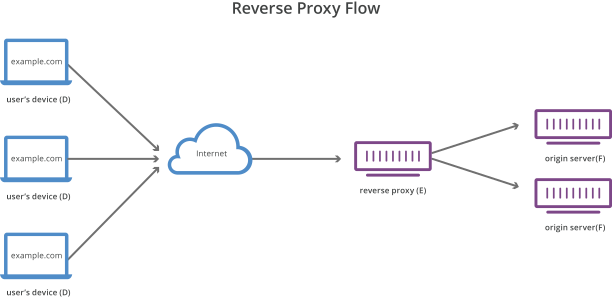

https://blog-cloudflare-com.webpkgcache.com/doc/-/s/blog.cloudflare.com/zh-cn/deep-dive-cloudflare-autonomous-edge-ddos-protection-zh-cn/

## Service Proxy

有两种类型的网络代理：

1. 反向代理(Reverse Proxy): 可理解成**服务端代理**，是服务端配置的一个中间代理服务器，负责将客户端的请求转发给后端服务器。 
   - 常被用于流量负载均衡(Load Balancer)、API网关、实现缓存/https/安全等功能。
   - 
2. 正向代理(Forward Proxy)/转发代理: 可理解成**客户端代理**，是客户端配置的一个中间代理服务器，负责将客户端的请求转发给后端服务器。 
   - 常被用于突破某些服务端的访问限制，或者在网络上隐藏自己的真实身份（Tor 洋葱代理）。
   - 也可用于添加某些访问限制：比如学校/企业可以通过前向代理禁止用户访问 一些娱乐网站。
   - 

下面介绍几种当下比较流行的代理软件：

全能选手，既可用做代理，又可用做 Web 服务器：

1. Nginx: 使用最广泛，最年长，性能也几乎是最高的，但是配置稍显复杂，学习起来有些门槛。
2. Caddy: 新兴的 Web Server & Network-Proxy。配置比 Nginx 简单，支持自动配置 SSL 证书，默认启用 HTTP2/HTTPS。
   - 是 go 语言写的，性能相比 Nginx 要弱一些，同时内存消耗比 Nginx 大很多。

专用代理软件：

1. Traefik: 一个纯粹的代理软件，支持自动配置 SSL 证书，配置很简单，功能相当丰富，还有好看的 Web UI。
   - Traefik 相对的，性能也要比 Nginx 差。
2. Envoy: Istio 钦定代理，在服务网格中专门负责流量转发
3. Linkerd: 用 rust 写的轻量高效的代理，值得一看。
4. [OpenResty](https://github.com/openresty/openresty): 基于 Nginx+Lua Web 平台，很多网关/代理的底层都是它。
   1. APISIX: 基于 Openresty 开发的 API 网关，国产项目。
      - 其核心贡献者同时也是 Openresty 社区的核心贡献者，相当活跃，性能也很高，值得考虑。
   2. Kong: 和 APISIX 一样都是基于 Openresty，虽然 Stars 很多，但是 APISIX 有后发优势，性能比 Kong 要好很多。
5. HAProxy: 一个 C 专用负载均衡器，单纯做负载均衡，它的性能比 Nginx 还要好些。
   - 但是纯四层负载均衡 LVS 性能比它更高，另外它的代码结构也不如 nginx，导致二次开发难度大，社区也就小很多。
   - 所以不推荐使用。

高性能的 4 层代理，只关注第四层，因此能获得更高的性能：

- ipvs: 有二十多年历史的 4 层负载均衡技术，linux 内核模块。
- [katran](https://github.com/facebookincubator/katran): Facebook 开源的，基于 eBPF 的新一代 4 层负载均衡。

在四层负载均衡方面，也有一些将 ipvs/eBPF 及其他技术结合起来的尝试，比如：

- [性能提升40%: 腾讯 TKE 用 ipvs+eBPF 绕过 conntrack 优化 K8s Service](https://juejin.cn/post/6844904198752960520)
- [网易数帆基于 DPDK 的高性能四层负载均衡实践](https://www.infoq.cn/article/hlhteohg8elx6eyveifl)

如果你需要插件热加载（hot-plugin）那目前基本上就只有 openresty(lua) 系与 envoy(wasm) 可选，其他项目加个插件还得重新编译整个代理。

## 参考

- [What is a reverse proxy? - cloudflare](https://www.cloudflare.com/learning/cdn/glossary/reverse-proxy/)

## Ingress Gateway

网关 Gateway，就是指一个流量的集中式出入口，网关有两种类型：

1. Ingress Gateway: 入网网关，所有请求都应该从这里进入集群。
2. Egress Gateway: 出口网关，顾名思义，它用于控制所有从集群出去的流量。

## 一、Ingress / API Gateway

Ingress 是 Kubernetes 中目前最成熟的入口网关资源，但是它的设计比较有局限性，许多能力都得通过 annotation 提供支持。

而 API Gateway 是一个通用的概念，指功能更丰富的入口网关。
具体而言，API Gateway 就是比普通的网关多干了一些以前我们在应用内部实现的事：身份认证，权限控制，基于来源的流量控制，日志服务等等。

>目前官方开发了新一代的网关资源：Gateway API，目前还处于 Alpha 阶段，让我们拭目以待。

Ingress 资源对应的控制器被称作 Ingress Controller，它负责使集群状态符合 Ingress 资源的描述。
但是现代 Kubernetes 集群中，我们常用的网关会更符合 API Gateway 的定义，功能要比 Ingress 这个官方资源的定义强很多，通常都使用 CRD 来实现。

这里着重介绍几个比较流行的社区实现，它们大都提供了一些更高级的特性，比如 JWT 身份验证、来源限流、或者直接提供了插件系统。

>可以在 [API Gateway - CNCF Cloud Native Landscape](https://landscape.cncf.io/card-mode?category=api-gateway&grouping=category) 中找到几乎所有流行的云原生 API 网关。

这样网关大都基于 Nginx/Openresty 或者 Envoy 实现，只有少部分网关是使用 Go/Java 等语言完全重新造的轮子。
其中 Nginx/Openresty 凭借其极高的性能与可拓展性占据一席之地，而 Envoy 则凭借其丰富的功能与面向云原生的设计占据了云原生领域的半壁江山。

>Nginx 在很长一段时间内都是 L7 负载均衡领域的王者，但是随着云计算的发展，企业对 API 网关的需求越来越强烈，开源 Nginx 本身渐渐无法满足需求。
最大的问题是 Nginx 的配置比较复杂，而且不够动态，无法满足 Kubernetes 网关以及其他场景的需要。而新一代 API 网关则瞄准了这一需求，提供基于 API 的动态配置方式，内置网关常用的所有能力，赢得了许多用户的喜爱。

基于 Envoy 实现的 API 网关：

- Istio IngressGateway
  - IngressGateway 虽然是 Istio 的原生解决方案，但是它的 access_log、metrics、direct_reponse、rate_limit 等能力当前都无法满足 API 网关的需要，感觉还存在许多缺陷。
  - rate_limit 能力在 Mixer 被去掉后，一直不太行
  - access_log 的问题在于，它不像 apisix 等网关一样，支持直接将 access_log 发送到 kafka 等中间件进行进一步处理。
  - direct_reponse 已经有对应的 PR 了：https://github.com/istio/istio/pull/39776
- https://github.com/solo-io/gloo
  - gloo 公司是 Istio 社区的核心贡献者之一，很活跃。
- https://github.com/projectcontour/contour
- https://github.com/emissary-ingress/emissary

基于 Ngninx/Openresty 实现的 API 网关：

- APISIX：国产项目，完全开源，借鉴了 Kong 的方案，但是官方宣称性能更好，架构更优。
  - APISIX 及其插件是完全开源的，而且功能非常丰富，作为网关用感觉很合适，可以考虑跟 Istio 服务网格结合使用。
- Kong：国外老牌项目，部分关键插件是收费的。
  - Kong 跟 APISIX 都是完全基于 Nginx/Openresty 实现的，但是 Kong 更偏商业化一些，许多插件都是收费的...
  - 根据我的简单压测，APISIX 的性能要略优于 Kong，尤其是 Kong 的部分插件性能比较差，这个好像都比较知名了，很多人都清楚 Kong 的插件性能问题...

其他 API 网关：

- https://github.com/traefik/traefik
- https://github.com/megaease/easegress
- https://github.com/apioak/apioak
- https://github.com/luraproject/lura
- https://github.com/TykTechnologies/tyk
- https://github.com/alibaba/Sentinel

## 二、Ingress / API Gateway 与服务网格集成 {#api-gateway-plus-service-mesh}

目前最流行的 Istio 服务网格自带了 Istio IngressGateway，它提供了基础的通信功能，以及有限的 metrics、access log 等能力，但是功能还是比较基础，无法支持许多环境下对 API 网关的深度需求：

- 负载均衡相关能力：负载均衡、流量切分、流量镜像、限流限并发
  - 其中 Istio 目前对限流限并发的支持不太行
- API 生命周期管理
  - Istio 就没这功能
- 请求与响应的 rewrite
  - Istio IngressGateway 提供了一定程度的支持，但是不太够
- 服务访问的SLA、限流及计费
  - Istio 无此功能
- 基于一些第三方机制的访问控制
  - Istio 对 JWT 提供一定支持
- 监控：按 Host/Path 等纬度划分的状态码、延时指标监控
  - Istio 支持此功能，但是默认不开 host/path 标签，直接打开还会导致指标数量暴增，可能需要自定义 EnvoyFilter 配置
- 访问日志：统一收集好访问日志后，可使用 SQL 对全局流量的 Host/Path/Headers/Params 等进行深度分析
  - Istio 支持，也可以通过 EnvoyFilter/Telemetry API 自定义访问日志格式

这些可能都需要我们自己写 EnvoyFilter 甚至 Envoy 插件才能实现，这样开发维护都是个难题。
因此即使你使用的是提供了网关方案的 Istio 服务网格，很多时候也必须要选择一个功能足够强大的第三方网关。

>比如如果你们已经利用 Nginx+Lua 实现过了这些类似的功能，那继续使用基于 Nginx+Lua 的网关方案是最佳的，迁移难度最低。

将 Ingress / API Gateway 与 Istio 等服务网格集成的最佳方法，就是把 Ingress 也当成一个普通服务来处理，注入一个 Sidecar Proxy，[如何为服务网格选择入口网关？ - 赵化冰](https://zhaohuabing.com/post/2019-03-29-how-to-choose-ingress-for-service-mesh/) 

虽然此方案在 Gateway 旁边加了一个 Sidecar Proxy，但是它带来的性能损失是完全可以接受的，它使任何 API Gateway 都能直接无痛接入 Istio 服务网格，哪怕这个网关是一个原始的基于配置文件的 Nginx 容器！都能直接利用上服务网格的 L7 负载均衡、流量分配、故障注入等等能力。

如果你们以前使用的是将 Nginx 部署在虚拟机上的方案，那么改造的第一步，就应该是将 Nginx 放在 Kubernetes 集群里部署并扩缩容，并且注入 Sidecar Proxy 以接入 Istio 服务网格，而外部则可通过云服务商的 L4 负载均衡、或者自建 keepalived(vrrp+ipvs) 对外提供高可用的静态公网 IP。

架构图如下：

```mermaid
flowchart LR
    C[Client] -->|Traffic| L4[L4 Proxy] --> G(Nginx Gateway)
    G --> P[Sidecar Proxy]
    P --> P_A[Sidecar Proxy] <--> A[Service A]
    P_A <---> P_D[Sidecar Proxy] <--> D[Service D]
    P --> P_B[Sidecar Proxy] --> B[Service B]
    subgraph Kubernetes
        subgraph Nginx Pod
        G
        P
        end
        subgraph Pod A
        A
        P_A
        end
        subgraph Pod D
        D
        P_D
        end
        subgraph Pod B
        B
        P_B
        end
    end
```

- https://github.com/kubernetes/enhancements/tree/master/keps/sig-network/2829-gateway-api-to-k8s-io
- https://github.com/kubernetes-sigs/gateway-api

## Nginx、OpenResty、Kong 的基本概念和区别联系

Nginx、OpenRestry、Kong 这三个项目关系比较紧密：

-   Nginx 是模块化设计的反向代理软件，C语言开发；
-   OpenResty 是以 Nginx 为核心的 Web 开发平台，可以解析执行 Lua 脚本
-   Kong 是 OpenResty 的一个应用，是一个 API 网关，具有API管理和请求代理的功能。

# Nginx

Nginx 是一个高性能的 HTTP 和反向代理 web 服务器，同时也提供了 IMAP/POP3/SMTP 服务。Nginx 是由伊戈尔·赛索耶夫为俄罗斯访问量第二的 Rambler.ru 站点（俄文：Рамблер）开发的，第一个公开版本0.1.0发布于2004年10月4日。

Nginx 是一个高性能的 Web 和反向代理服务器, 它具有有很多非常优越的特性:

作为 Web 服务器：相比 Apache，Nginx 使用更少的资源，支持更多的并发连接，体现更高的效率，这点使 Nginx 尤其受到虚拟主机提供商的欢迎。能够支持高达 50,000 个并发连接数的响应，感谢 Nginx 为我们选择了 epoll and kqueue 作为开发模型.

作为负载均衡服务器：Nginx 既可以在内部直接支持 Rails 和 PHP，也可以支持作为 HTTP代理服务器 对外进行服务。Nginx 用 C 编写, 不论是系统资源开销还是 CPU 使用效率都比 Perlbal 要好的多。

作为邮件代理服务器: Nginx 同时也是一个非常优秀的邮件代理服务器（最早开发这个产品的目的之一也是作为邮件代理服务器），Last.fm 描述了成功并且美妙的使用经验。

Nginx 安装非常的简单，配置文件 非常简洁（还能够支持perl语法），Bugs非常少的服务器: Nginx 启动特别容易，并且几乎可以做到7\*24不间断运行，即使运行数个月也不需要重新启动。你还能够在 不间断服务的情况下进行软件版本的升级。

# OpenResty

OpenResty® 是一个基于 Nginx 与 Lua 的高性能 Web 平台，其内部集成了大量精良的 Lua 库、第三方模块以及大多数的依赖项。用于方便地搭建能够处理超高并发、扩展性极高的动态 Web 应用、Web 服务和动态网关。

OpenResty® 通过汇聚各种设计精良的 Nginx 模块（主要由 OpenResty 团队自主开发），从而将 Nginx 有效地变成一个强大的通用 Web 应用平台。这样，Web 开发人员和系统工程师可以使用 Lua 脚本语言调动 Nginx 支持的各种 C 以及 Lua 模块，快速构造出足以胜任 10K 乃至 1000K 以上单机并发连接的高性能 Web 应用系统。

OpenResty® 的目标是让你的Web服务直接跑在 Nginx 服务内部，充分利用 Nginx 的非阻塞 I/O 模型，不仅仅对 HTTP 客户端请求,甚至于对远程后端诸如 MySQL、PostgreSQL、Memcached 以及 Redis 等都进行一致的高性能响应。

# Kong

Kong 是 API 管理的强大效率工具。对需要从事 API 管理的广大开发员来说，它是最出色的工具之一。Kong 是开源工具，具有可扩展性和模块性，可以在任何一种基础设施上运行。多年来，Kong 一直在支持优秀的开发项目，比如 Mashape（世界上规模最大的API市场）。最棒的是，Kong得到了强大的 Nginx 的支持。

Kong的主要特性

-   Kong 的扩展性：只要增添更多的服务器实例，它就能横向扩展，毫无问题，那样你可以支持更多流量，同时确保网络延迟很短。
-   Kong 的灵活性：它可以部署在单个或多个数据中心环境的私有云或公有云上。它还支持大多数流行的操作系统，比如Linux、Mac和Windows。Kong包括许多实用技巧，以便针对大多数现代平台完成安装和配置工作。
-   Kong 的模块性：它可以与新的插件协同运行，扩展基本功能。可将你的API与许多不同的插件整合起来，以增强安全、分析、验证、日志及/或监测机制。最好的例子之一就是Nginx Plus插件（[https://getkong.org/plugins/nginx-plus-monitoring/](https://getkong.org/plugins/nginx-plus-monitoring/)），该插件提供了服务器实时监测机制，以获得关于负载和请求的度量指标和统计数字。
-   Kong 的生态：虽然 Kong 是开源工具，可供每个人免费使用，但你也能获得企业版，企业版通过电子邮件、电话和聊天提供了快速支持，此外还提供初始安装、从第三方API管理工具来迁移、紧急补丁、热修复程序及更多特性。