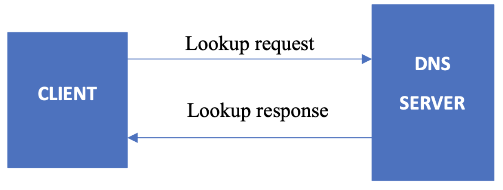
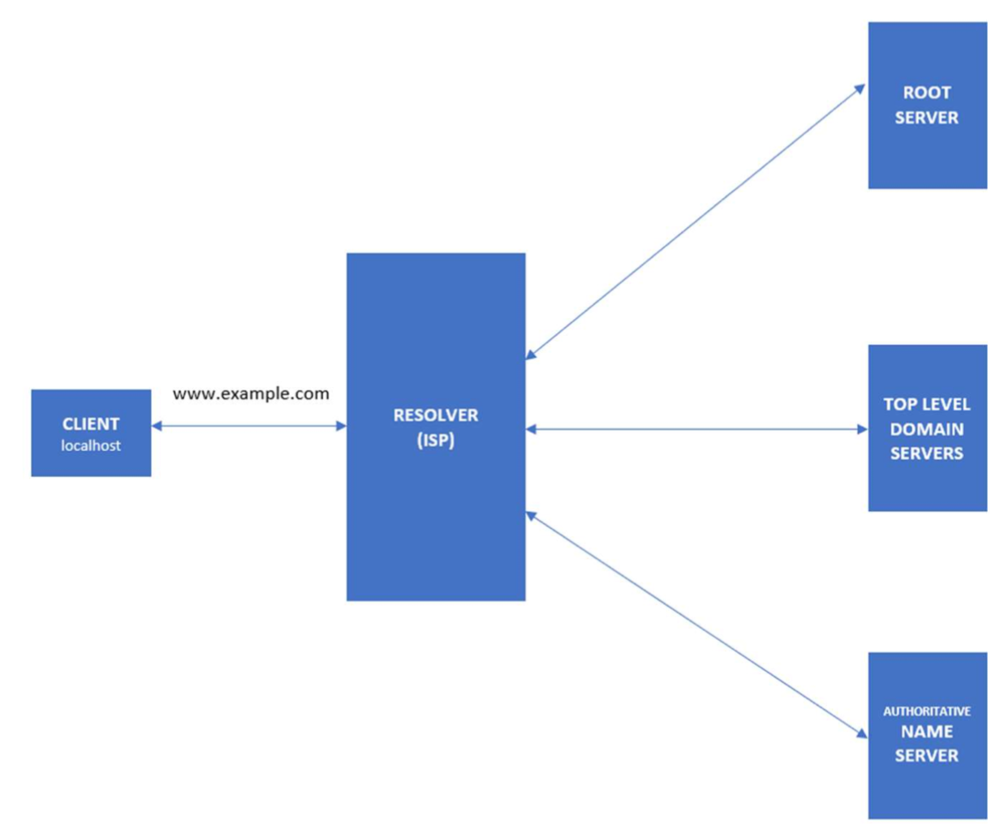

https://www.cnblogs.com/f-ck-need-u/p/7048359.html#blogservice

https://www.cnblogs.com/f-ck-need-u/p/7367503.html

- https://wiki.archlinux.org/title/Dnscrypt-proxy
- https://www.v2ex.com/t/742709
- https://boce.aliyun.com/detect/dns/DNS_PING-55e41bb2aff9db99decd9d9da1be445d-1652369079406


https://www.cnblogs.com/f-ck-need-u/p/7367503.html

https://www.thesslstore.com/blog/dns-over-tls-vs-dns-over-https/
https://developers.google.com/speed/public-dns/docs/dns-over-tls?hl=zh-cn
https://developers.google.com/speed/public-dns/docs/using?hl=zh-cn
https://ns1.com/resources/dns-zones-explained


DNS(Domain name system)

推荐阅读书籍：《DNS & bind》


DNS主要是用于将域名解析为IP地址的协议，有时候也用于将IP地址反向解析成域名，所以DNS可以实现双向解析。

DNS可以使用TCP和UDP的53端口，基本使用UDP协议的53端口。


DNS over TLS 和 DNS over HTTPS
DNS-over-TLS
基于 TLS 的 DNS (DoT) 和基于 HTTPS 的 DNS (DoH) 听起来它们是同一事物的可互换术语。他们实际上完成了同样的事情——加密 DNS 请求——但有一个很大的不同：他们使用的端口。


## 概念原理

什么是 DNS zone ？
DNS Zone Levels
DNS Root Zone
TLD Zones
Domain Zones
Secondary DNS Zones
All About the DNS Zone File


DNS Zone Types
区域文件有两种类型:

A DNS Primary File which authoritatively describes a zone
一个 DNS 主文件，它以权威的方式描述一个区域
A DNS Cache File which lists the contents of a DNS cache—this is only a copy of the authoritative DNS zone
列出 DNS 缓存内容的 DNS 缓存文件ーー这只是权威 DNS 区域的副本


DNS Zone Records
DNS 区域记录

在区域文件中，每一行表示一个 DNS 资源记录(RR)。记录由以下字段组成:

Name is an alphanumeric identifier of the DNS record. It can be left blank, and inherits its value from the previous record.
Name 是 DNS 记录的字母数字标识符。它可以保留为空，并从以前的记录继承其值。
TTL (time to live) specifies how long the record should be kept in the local cache of a DNS client. If not specified, the global TTL value at the top of the zone file is used.
TTL (生存时间)指定记录应该在 DNS 客户机的本地缓存中保存多长时间。如果未指定，则使用区域文件顶部的全局 TTL 值。
Record class indicates the namespace—typically IN, which is the Internet namespace.
记录类指示命名空间ーー通常为 IN，即 Internet 命名空间。
Record type is the DNS record type—for example an A record maps a hostname to an IPv4 address, and a CNAME is an alias which points a hostname to another hostname.
记录类型是 DNS 记录类型ーー例如，A 记录将主机名映射到 IPv4地址，CNAME 是将主机名指向另一个主机名的别名。
Record data has one or more information elements, depending on the record type, separated by a white space. For example an MX record has two elements—a priority and a domain name for an email server.
根据记录类型，记录数据有一个或多个信息元素，它们之间用空格分隔。例如，MX 记录有两个元素: 优先级和电子邮件服务器的域名。


Zone File Structure
区域文件结构
DNS 区域文件以两个强制记录开始:

Global Time to Live (TTL), which specifies for how records should be kept in local DNS cache.
全局生存时间(TTL) ，指定记录应如何保存在本地 DNS 缓存中。
Start of Authority (SOA) record—specifies the primary authoritative name server for the DNS Zone.
Start of Authority (SOA)记录ー指定 DNS 区域的主要权威名称服务器。
After these two records, the zone file can contain any number of resource records, which can include:

在这两条记录之后，区域文件可以包含任意数量的资源记录，这些记录可以包括:

Name Server records (NS)—specifies that a specific DNS Zone, such as “example.com” is delegated to a specific authoritative name server
Name Server record (NS)ー指定将特定的 DNS 区域(如“ example.com”)委托给特定的权威名称服务器
IPv4 Address Mapping records (A)—a hostname and its IPv4 address.
IPv4地址映射记录(A)ーー主机名及其 IPv4地址。
IPv6 Address records (AAAA)—a hostname and its IPv6 address.
IPv6地址记录(AAAA)ーー主机名及其 IPv6地址。
Canonical Name records (CNAME)—points a hostname to an alias. This is another hostname, which the DNS client is redirected to
规范名称记录(CNAME)ー将主机名指向别名。这是另一个主机名，DNS 客户端将重定向到该主机名
Mail exchanger record (MX)—specifies an SMTP email server for the domain.
邮件交换器记录(MX)ー指定域的 SMTP 电子邮件服务器。


DNS Zone File Example
DNS 区域文件示例

```bash
$ORIGIN example.com. ; start of the zone file$TTL 30m ; default cache expiration time for resource recordsexample.com. IN SOA ns.example.com. root.example.com. ( 1999120701 ; serial number of this zone file1d ; frequency to refresh secondary DNS (d=day)1d ; frequency to refresh secondary DNS in case of problem4w ; secondary DNS expiration time (w=week)1h ; minimum caching time if resolution failedexample.com. NS dns1.dnsprovider.com. ; there are two name server that can provide DNS services for example.comexample.com. NS dns2.dnsprovider.com.example.com. MX 10 mx1.dnsprovider.com ; mail serverexample.com. MX 10 mx2.dnsprovider.comexample.com. A 192.168.100.1 ; IP address for root domain www A 192.168.100.1 ; IP address for www subdomain
```


DNS Zones and Next-Generation DNS Services
域名服务区域和下一代域名服务

传统的 DNS 基础设施有其局限性。很久以前，一个 IP 地址指向一个服务器。现在，一个 IP 地址可以隐藏一个负载均衡的网络资源池，这些资源部署在全球不同的数据中心上。为了有效地向用户提供这些资源，确保高性能并允许快速传播更改，您应该考虑使用下一代 DNS 提供程序，如 NS1。

NS1 Provides:
NS1提供:
Managed DNS - a DNS service powered by a high-performance, anycast global DNS network, with advanced traffic management features.
管理 DNS-一个 DNS 服务的高性能，任意广播全球 DNS 网络，具有先进的流量管理功能。
Dedicated DNS - fully managed DNS deployment, on premise or in the cloud, with advanced point-and-click traffic management
专门的 DNS-完全管理的 DNS 部署，在前提或在云中，与先进的点击和点击流量管理
## 常用操作

### 清除DNS缓存
### 不同区域解析不同DNS


参考文档 https://www.redhat.com/sysadmin/dns-configuration-introduction

Domain Name System (DNS) 域名系统 用于将主机名解析 为IP地址  
在本文中，您将学习 DNS 的基础知识，从 DNS 如何获取 IP 地址和主机名，到正向和反向查找区域的概念。它还将向您展示如何安装和配置 DNS，定义和编辑区域文件，并验证 DNS 是否可以通过命令帮助解析到正确的地址。如果您刚接触 DNS，本文将帮助您使用基本配置在系统上使用它。

## 域名系统是如何工作的

当客户端从命名服务器请求信息时，它通常连接到端口53，然后命名服务器解析所请求的名称。


(Ashish Bharadwaj, CC BY-SA 4.0)
Sending a request from the DNS client to the DNS server is called a 
从 DNS 客户机向 DNS 服务器发送请求称为 lookup request.查找请求。
Getting a response from the DNS server to the DNS client is called a lookup response.
从 DNS 服务器到 DNS 客户端的响应称为查找响应。
The system on which the DNS service is configured is called a DNS server.
配置 DNS 服务的系统称为 DNS 服务器。
The system that accesses the DNS server is called a DNS client.
访问 DNS 服务器的系统称为 DNS 客户端。


## Where does DNS get IP addresses? DNS 从哪里获得 IP 地址？


您可能想知道 DNS 如何获得相应主机名或域名的 IP。DNS 如何在不同的 IP 地址之间进行搜索并正确地关联您的域名？谁存储域名和 IP 地址之间的映射？  
DNS 工作流说明了如何在 DNS 中进行通信以及如何解析地址。

(Ashish Bharadwaj, CC BY-SA 4.0)
When the client searches for the domain www.example.com, the request will initially go to the internet service provider's (ISP) resolver. It will respond to the user's request to resolve a domain name.
当客户机搜索域 www.example.com 时，请求最初将转到 Internet 服务提供商(ISP)的解析器。它将响应用户解析域名的请求。
If the IP address is not found on the resolver, the request is forwarded to a root DNS server and later to the top-level domain (TLD) servers.
如果在解析器上没有找到 IP 地址，请求就会被转发到根 DNS 服务器，然后再转发到顶级域(tLD)服务器。
TLD servers store information for top-level domains, such as .com or .net.
TLD 服务器存储顶级域(如.com 或.net)的信息。
Requests are forwarded to the nameservers, which know detailed information about domains and IP addresses.
请求被转发到名称服务器，这些服务器知道域和 IP 地址的详细信息。
Nameservers respond to the ISP's resolver, and then the resolver responds to the client with the requested IP.
命名服务器响应 ISP 的解析器，然后解析器用请求的 IP 响应客户机。
When the resolver doesn't know the IP, it stores the IP and its domain in a cache to service future queries.
当解析器不知道 IP 时，它将 IP 及其域存储在缓存中，以便为将来的查询提供服务。

## Forward and reverse lookups 正向和反向查找

正向查找区域使用域名搜索 IP 地址，而反向查找区域使用 IP 地址搜索域名。


(Ashish Bharadwaj, CC BY-SA 4.0)

