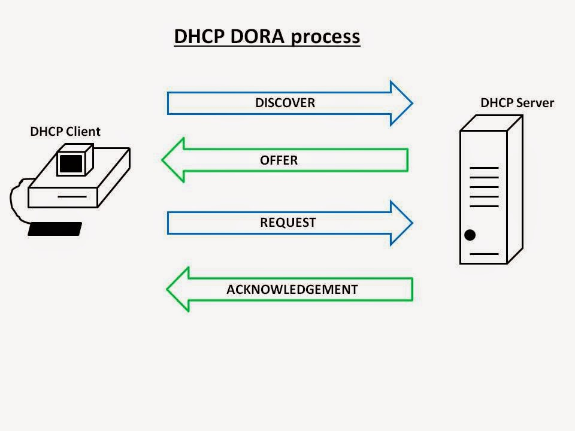

DHCP (Dynamic Host Configuration Protocol,动态主机配置协议) 和 BOOTP（Bootstrap Protocol,引导协议）这两个网络协议，用于在计算机网络中为主机用于分配 IP 地址、子网掩码、网关、DNS 地址、NTP 地址等网络参数。

- BOOTP 是一种静态的协议，是一个早期的网络协议，主要用于在启动时分配 IP 地址。它需要手动配置客户端的 MAC 地址和 IP 地址，不支持动态分配 IP 地址，因此使用起来比较麻烦。现已被 DHCP 取代。

- DHCP 是一种动态的协议，它支持自动分配 IP 地址、支持动态 IP 地址池、IP 地址的租赁和续租、网络配置信息的更新(如 DNS NTP 地址)、支持 IPv6 等。使得网络管理员可以更轻松地管理网络。

总的来说，DHCP 是对旧协议 BOOTP 的增强，更易于管理和更适合大型网络环境，是目前应用更广泛的网络协议。

:::tip
DHCP 是应用层的协议，客户端使用 UDP 68 端口，服务端使用 UDP 67 端口。
:::

本节将介绍 DHCP 协议的工作原理。常见 DHCP Server 的配置详见下列文章。

import DocCardList from '@theme/DocCardList';

<DocCardList />

## DHCP 协议工作原理

### DORA Process
  DORA Process 是 DHCP 协议中的一种流程，也是 DHCP 协议中的一个重要组成部分，包括 Discover（发现）、Offer（提供）、Request（请求）和Acknowledge（确认）四个步骤，用于为网络设备分配IP地址和其他网络配置信息。
  

下面我们来看一下**DORA Process 的工作过程简述**：
1. DHCP Discover - [广播]
  - 客户端没有任何 IP 地址，所以使用 0.0.0.0 作为源 IP 地址，发送 DHCP 广播请求（DHCP DISCOVER 报文），以查找 DHCP 服务器。
  ```yaml title="包含信息如下"
  Source IP: 0.0.0.0
  Destination IP: 255.255.255.255
  Source MAC: DHCP Client Machine MAC Address
  Destination MAC: FF:FF:FF:FF:FF:FF
  ```
2. DHCP Offer - [广播]
  - 当服务器接收到 Discover 请求时，它会向客户端响应 DHCP Offer 请求，提供可用的 IP 地址和租约信息(包括子网掩码、网关地址、租用期、DNS 地址、NTP 地址、提供响应的 DHCP 服务器的IP地址等)。
  ```yaml title="包含信息如下"
  Source IP: DHCP Server IP Address
  Destination IP: 255.255.255.255
  Source MAC: DHCP Server Machine MAC Address
  Destination MAC: DHCP client MAC Address
  ```
3. DHCP Request - [广播]
  - 当客户端收到 Offer 应答信息后，客户端会从众多 DHCP 中选择一个 DHCP 的分配的IP地址。同时客户端还会向网络发送一个 ARP(Address Resolution Protocol,地址解析协议) 包，查询网络上面有没有其他机器使用该 IP 地址。如果发现该IP 地址已经被占用，客户端则会送出一个 DHCPDISCOVER 数据包给 DHCP 务器，拒绝接受其 DHCPDISCOVER，并重新发送 DHCPDISCOVER 信息。
  - 然后客户端将以广播方式发送 Request 请求消息。(在 Request 信息中包含客户端所接受的IP地址，既通知它已选择的 DHCP 服务器，也通知其他 DHCP 服务器，以便释放它们保留的IP地址。)
  ```yaml title="包含信息如下"
  Source IP: DHCP Server IP Address
  Destination IP: 255.255.255.255
  Source MAC: DHCP Server Machine MAC Address
  Destination MAC: DHCP client MAC Address.
  ```
  :::tip
  客户端选择第一个接收到的IP。谁的IP先到客户端的速度是不可控的。但是如果在配置文件里开启了 authoritative 选项则表示该服务器是权威服务器，其他DHCP服务器将失效，如果多台服务器都配置了这个权威选项，则还是竞争机制。  
  :::

4. DHCP Acknowledge - [广播]
  - DHCP 服务器接受到 Request 信息后，将已保留的IP地址标识为已租用，并以广播方式发送一个 DHCP 应答信息(DHCPACK) 给 DHCP 客户端，该信息包含IP地址的有效租约以及其他配置信息。
  ```yaml title="包含信息如下"
  Source IP: DHCP Server IP Address
  Destination IP: 255.255.255.255
  Source MAC: DHCP Server Machine MAC Address
  Destination MAC: DHCP client MAC Address
  ```

:::tip
如果DHCP 客户端和服务器位于不同的逻辑网段（如多个vlan或不同子网），则可以使用 DHCP Relay 中继代理充当转发器，在不同网段之间通过路由将 DHCP 广播包的内容通过单播的方式转发给 DHCP 服务器。

即 DHCP Relay 中继在收到 dhcp 广播后，会广播改为单播，单播封装的源ip就是其收到这个广播的接口地址，dhcp 服务器根据这个接口地址选择 dhcp 池。
:::  

<details>
<summary>客户端何时会触发 DORA Process？</summary>

当客户端处于以下四种状态之一时会触发 DORA Process
- 初始状态：当客户端首次启动或重新启动时，它处于初始状态。
- 重新请求租约状态：当客户端的IP租约过期或在一定时间内未能成功续租时，客户端会发送DHCP请求消息以请求新的IP租约。此时客户端处于重新请求租约状态。
- 释放状态：当客户端不再需要IP地址时，它可以向服务器发送DHCP释放消息，以释放已经分配的IP地址。此时客户端处于释放状态。
  例如在 Windows 中，为了释放和更新DHCP分配的IP，我们使用如下命令：
  ```powershell
  ipconfig /release
  ipconfig /renew
  ```
  在 linux 中使用
  ```bash
  sudo dhclient -r
  sudo dhclient -r eth0
  # -r表示release(释放)
  sudo dhclient
  sudo dhclient eth0
  ```
- 拒绝状态：当服务器向客户端分配的IP地址与客户端所处的网络不兼容时，客户端会拒绝接受分配的IP地址。此时客户端处于拒绝状态。

</details>

### DHCP 客户端状态机  

DHCP 客户端状态机是指 DHCP 客户端在执行 DORA Process 流程时所遵循的状态变更机制,包括初始化、选择、请求、绑定等状态，用于协调客户端与DHCP服务器之间的通信，以获取网络配置信息。

- **INIT 状态：**  
  DHCP客户端第一次启动时，处于INIT状态（初始化状态）。客户端使用端口 67 广播 DHCPDISCOVER 消息（带有 DHCPDISCOVER 选项的请求消息）。
- **SELECTING 状态：**  
  客户端发送DHCPDISCOVER报文后，进入选择状态。那些可以提供此类服务的服务器以 DHCPOFFER 消息响应。在这些消息中，服务器提供了一个 IP 地址。他们还可以提供租赁期限。默认值为 1 小时。发送 DHCPOFFER 的服务器会锁定所提供的 IP 地址，以便其他任何客户端都无法使用该地址。客户端选择其中一个提议并向所选服务器发送 DHCPREQUEST 消息。然后它进入请求状态。但是，如果客户端没有收到 DHCPOFFER 消息，它会再尝试四次，每次间隔为 2 秒。如果没有对任何这些 DHCPDISCOVER 的回复，客户端将休眠 5 分钟，然后再试一次。
- **REQUESTING 状态：**   
  客户端保持在请求状态，直到它收到来自服务器的 DHCPACK 消息，该消息创建客户端物理地址与其 IP 地址之间的绑定。收到 DHCPACK 后，客户端进入绑定状态。
- **BOUND 状态：**  
  在这种状态下，客户端可以使用IP地址直到租约到期。当达到租期的 50% 时，客户端发送另一个 DHCPREQUEST 请求续订。然后它进入更新状态。处于绑定状态时，客户端也可以取消租约，进入初始化状态。
- **RENEWING 状态 ：**  
  客户端保持在更新状态，直到两个事件之一发生。它可以收到 DHCPACK，更新租用协议。在这种情况下，客户端重置其计时器并返回到绑定状态。或者，如果未收到 DHCPACK，并且 87.5% 的租用时间到期，客户端将进入重新绑定状态。
- **REBOUND 状态 ：**  
  客户端保持重新绑定状态，直到三个事件之一发生。如果客户端收到 DHCPNACK 或租约到期，它会回到初始化状态并尝试获取另一个 IP 地址。如果客户端收到 DHCPACK，它将进入绑定状态并重置计时器。

下图为 DHCP 客户端部分状态机：


此图显示了 DHCP 客户端使用的部分状态机。彩色背景区域显示了 DHCP 客户端在通过四个主要 DHCP 进程时所进行的转换：分配、重新分配、更新和重新绑定。

这只是部分状态机的总结，并没有显示所有可能的事件和转换，因为它已经足够复杂了。

### DHCP 租约种类
DHCP为设备分配IP地址的三种方式：

- 静态分配：  
  这种方法需要匹配客户端 MAC 地址，看是否能在静态租约表中找到对应的项，若能找到就把IP分配给他。  
  静态表中的IP不能被其他客户使用。  
  通过MAC地址给客户端配置固定IP也会优先于动态分配。

- 动态分配：  
  使用此方法，DHCP 会自动将 IP 地址永久分配给从可用地址池中选择的设备，通常 DHCP 用于为客户端分配临时地址，但 DHCP 服务器可以允许无限的租用时间。具体过程如下：

  - server 试图分配给 client 上次分配过的 IP，在这之前检查这个 IP 是否正在使用。
  - discover 中含有 request ip 时，检查该 IP 是否在地址池范围，是否正在使用，是否到期，是否是静态 IP 等。
  - discover 不含 request ip，从地址池上寻找一个最小的可用IP分配。

- 租赁时间分配：  
  在这种方法中，DHCP 服务器将从地址池中分配 IP 地址一段时间或在服务器上配置的租约，或者直到客户端通知服务器它不再需要该地址，客户端将收到它们的配置属性是动态的，先到先得。


### DHCP 续租 [单播]

DHCP 续租请求从 DHCP 客户端直接发送到 DHCP 服务器，以在 IP 地址租用时间的 50% 后更新 IP 地址分配。

- T1 时刻是租期到一半的时候，T2 时刻是租期到 87.5% 的时候。在 T1 时刻 客户端会单播一个 DHCP Request 报文给服务端 ，请求续租 IP 地址。如果客户端收到了 DHCP Ack 回应报文，则说明续租成功。
- 如果直到 T2 时刻，客户端都未收到 DHCP Ack 回应报文，那么会广播发送一个 DHCP Request 报文，继续请求续租 IP 地址。如果客户端收到了 DHCP Ack 回应报文，则说明续租成功。
- 如果直到租期到期， 客户端都未收到 DHCP Ack 回应报文，那么必须停止使用原来的 IP 地址。 客户端将从发现阶段开始，重新来申请一个 IP 地址。


## 参考文档
- 关于 Dora 进程描述详见：[What Is The Dora Process?](https://in.indeed.com/career-advice/career-development/dora-process)
- 更多状态机内容详见：[DHCP General Operation and Client Finite State Machine](http://www.tcpipguide.com/free/t_DHCPGeneralOperationandClientFiniteStateMachine.htm)
- DHCP 报文内容详见： [DHCP Message Format](http://www.tcpipguide.com/free/t_DHCPMessageFormat.htm)
