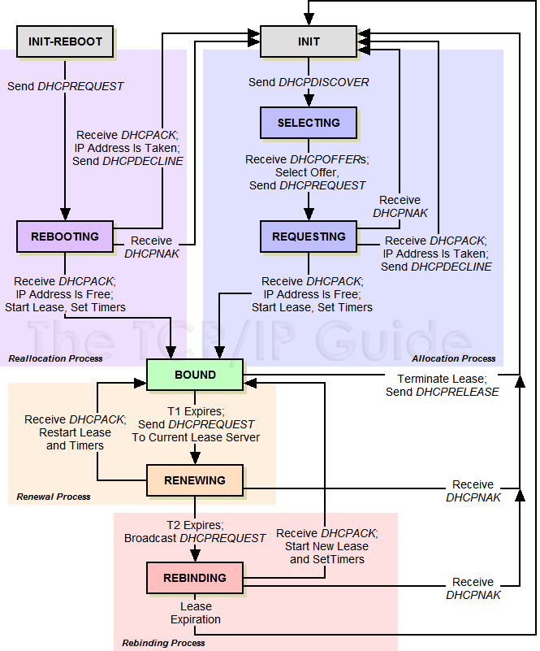

DHCP (Dynamic Host Configuration Protocol,动态主机配置协议) 和 BOOTP（Bootstrap Protocol,引导协议）这两个网络协议，用于在计算机网络中为主机用于分配 IP 地址、子网掩码、网关、DNS 地址、NTP 地址等网络参数。

- BOOTP 是一种静态的协议，是一个早期的网络协议，主要用于在启动时分配 IP 地址。它需要手动配置客户端的 MAC 地址和 IP 地址，不支持动态分配 IP 地址，因此使用起来比较麻烦。现已被 DHCP 取代。

- DHCP 是一种动态的协议，它支持自动分配 IP 地址、支持动态 IP 地址池、IP 地址的租赁和续租、网络配置信息的更新(如 DNS NTP 地址)、支持 IPv6 等。使得网络管理员可以更轻松地管理网络。

总的来说，DHCP 是对旧协议 BOOTP 的增强，更易于管理和更适合大型网络环境，是目前应用更广泛的网络协议。

:::tip
DHCP 是应用层的协议，客户端使用 UDP 68 端口，服务端使用 UDP 67 端口。
:::

本节将介绍 DHCP 协议的工作原理。常见 DHCP Server 的配置详见下列文章。

import DocCardList from '@theme/DocCardList';

<DocCardList />

## DHCP 协议工作原理

- **DORA Process**  
  DORA Process 是 DHCP 协议中的一种流程，也是 DHCP 协议中的一个重要组成部分，包括 Discover（发现）、Offer（提供）、Request（请求）和Acknowledge（确认）四个步骤，用于为网络设备分配IP地址和其他网络配置信息。
  
- **DHCP 客户端状态机**  
  DHCP 客户端状态机是指 DHCP 客户端在执行 DORA Process 流程时所遵循的状态变更机制,包括初始化、选择、请求、绑定等状态，用于协调客户端与DHCP服务器之间的通信，以获取网络配置信息。 
  
  - DHCP获得ip地址的步骤：discover­>offer­>request­>ack(nak)
  - DHCP刷新租期的步骤：request­>ack(nak)
  - DHCP释放ip的步骤：release

下面我们来看一下**DORA Process 的工作过程简述**：
1. DHCP Discover - [广播]
  - 客户端没有任何 IP 地址，所以使用 0.0.0.0 作为源 IP 地址，发送 DHCP 广播请求（DHCP DISCOVER 报文），以查找 DHCP 服务器。
  ```yaml title="包含信息如下"
  Source IP: 0.0.0.0
  Destination IP: 255.255.255.255
  Source MAC: DHCP Client Machine MAC Address
  Destination MAC: FF:FF:FF:FF:FF:FF
  ```
1. DHCP Offer - [广播]
  - 当服务器接收到 Discover 请求时，它会向客户端响应 DHCP Offer 请求，提供可用的 IP 地址和租约信息(包括子网掩码、网关地址、租用期、DNS 地址、WINS 服务器地址、提供响应的 DHCP 服务器的IP地址等)。
  ```yaml title="包含信息如下"
  Source IP: DHCP Server IP Address
  Destination IP: 255.255.255.255
  Source MAC: DHCP Server Machine MAC Address
  Destination MAC: DHCP client MAC Address
  ```
1. DHCP Request - [广播]
  - 当客户端收到 Offer 应答信息后，客户端会从众多DHCP中选择一个DHCP的分配的IP地址，同时客户端还会向网络发送一个 ARP(Address Resolution Protocol,地址解析协议) 包，查询网络上面有没有其他机器使用该 IP 地址。如果发现该IP 地址已经被占用，客户端则会送出一个 DHCPDISCOVER 数据包给 DHCP 务器，拒绝接受其 DHCPDISCOVER，并重新发送 DHCPDISCOVER 信息。
  - 然后客户端将以广播方式发送 Request 请求消息。(在 Request 信息中包含客户端所接受的IP地址，既通知它已选择的 DHCP 服务器，也通知其他 DHCP 服务器，以便释放它们保留的IP地址。)
  ```yaml title="包含信息如下"
  Source IP: DHCP Server IP Address
  Destination IP: 255.255.255.255
  Source MAC: DHCP Server Machine MAC Address
  Destination MAC: DHCP client MAC Address.
  ```
  :::tip
  客户端选择第一个接收到的IP。谁的IP先到客户端的速度是不可控的。但是如果在配置文件里开启了 authoritative 选项则表示该服务器是权威服务器，其他DHCP服务器将失效，如果多台服务器都配置了这个权威选项，则还是竞争机制
  
  通过MAC地址给客户端配置固定IP也会优先于普通的动态 DHCP 分配。
  :::

4. DHCP Acknowledge - [广播]
  DHCP 服务器接受到 Request 信息后，将已保留的IP地址标识为已租用，并以广播方式发送一个 DHCP 应答信息(DHCPACK) 给 DHCP 客户端，该信息包含IP地址的有效租约以及其他配置信息。
  ```yaml title="包含信息如下"
  Source IP: DHCP Server IP Address
  Destination IP: 255.255.255.255
  Source MAC: DHCP Server Machine MAC Address
  Destination MAC: DHCP client MAC Address
  ```

**当客户端处于以下四种状态之一时，会触发 DORA Process：**

- 初始状态：当客户端首次启动或重新启动时，它处于初始状态。
- 重新请求租约状态：当客户端的IP租约过期或在一定时间内未能成功续租时，客户端会发送DHCP请求消息以请求新的IP租约。此时客户端处于重新请求租约状态。
- 释放状态：当客户端不再需要IP地址时，它可以向服务器发送DHCP释放消息，以释放已经分配的IP地址。此时客户端处于释放状态。
  例如在Windows中，为了释放和更新DHCP分配的IP，我们使用命令：
  ```powershell
  ipconfig /release
  ipconfig /renew
  ```
  在 linux 中使用
  ```bash
  sudo dhclient -r
  sudo dhclient -r eth0
  # -r表示release(释放)
  sudo dhclient
  sudo dhclient eth0
  ```
- 拒绝状态：当服务器向客户端分配的IP地址与客户端所处的网络不兼容时，客户端会拒绝接受分配的IP地址。此时客户端处于拒绝状态。

:::tip
如果DHCP 客户端和服务器位于不同的逻辑网段（如多个vlan或不同子网），则可以使用 DHCP Relay 中继代理充当转发器，在不同网段之间通过路由将 DHCP 广播包的内容通过单播的方式转发给 DHCP 服务器。

即 DHCP Relay 中继在收到 dhcp 广播后，会广播改为单播，单播封装的源ip就是其收到这个广播的接口地址，dhcp服务器根据这个接口地址选择dhcp池
:::

5. DHCP 续租 ：- [单播]

- **服务端租约表**  
  - 静态租约表：对应一个静态租约存储文件，server运行时从文件中读取静态租约表。
  - 动态租约表：对应一个周期存储文件，server周期性将租约表存进该文件，在程序开始时将会读取上次存放的租约表。（租约表记录了当前所有分配的租约，包括静态链接的）。

- 静态租用：首先匹配MAC地址，看是否能在静态租约表中找到对应的项，若能找到就把IP分配给他。静态表中的IP不能被其他客户使用。

- 动态租用：
  1. server试图分配给client上次分配过的IP，在这之前检查这个IP是否正在使用。
  2. discover中含有request ip 时，检查该IP是否在地址池范围，是否正在使用，是否到期，是否是静态IP，网络上是否已经存在。
  3. discover不含request ip，从地址池上寻找一个最小的可用IP分配。

这些请求从 DHCP 客户端直接发送到 DHCP 服务器，以在 IP 地址租用时间的 50% 后更新 IP 地址分配。

T1 时刻是租期到一半的时候，T2 时刻是租期到 87.5% 的时候。在 T1 时刻 客户端会单播一个 DHCP Request 报文给服务端 ，请求续租 IP 地址。如果客户端收到了 DHCP Ack 回应报文，则说明续租成功。

如果直到 T2 时刻，客户端都未收到 DHCP Ack 回应报文，那么会广播发送一个 DHCP Request 报文，继续请求续租 IP 地址。如果客户端收到了 DHCP Ack 回应报文，则说明续租成功。

如果直到租期到期， 客户端都未收到 DHCP Ack 回应报文，那么必须停止使用原来的 IP 地址。 客户端将从发现阶段开始，重新来申请一个 IP 地址。

:::tip
有些机器希望一直使用一个固定的IP，也就是静态IP，除了手动进行配置，DHCP服务器也可以实现这个功能。DHCP服务器可以根据MAC地址来分配这台机器固定IP地址（保留地址），即使重启或重装了系统也不会改变根据MAC地址分配的地址。
:::

## DHCP 报文
上面提到了很多报文，这里简单做一个总结。
- DHCP DISCOVER ：客户端开始DHCP过程发送的包，是DHCP协议的开始
- DHCP OFFER ：服务器接收到DHCP DISCOVER之后做出的响应，它包括了给予客户端的IP（yiaddr）、客户端的MAC地址、租约过期时间、服务器的识别符以及其他信息
- DHCP REQUEST ：客户端对于服务器发出的DHCP OFFER所做出的响应。在续约租期的时候同样会使用。
- DHCP ACK ：服务器在接收到客户端发来的DHCP REQUEST之后发出的成功确认的报文。在建立连接的时候，客户端在接收到这个报文之后才会确认分配给它的IP和其他信息可以被允许使用。
- DHCP NAK ：DHCP ACK的相反的报文，表示服务器拒绝了客户端的请求。
- DHCP RELEASE ：一般出现在客户端关机、下线等状况。这个报文将会使DHCP服务器释放发出此报文的客户端的IP地址
- DHCP INFORM ：客户端发出的向服务器请求一些信息的报文
- DHCP DECLINE :当客户端发现服务器分配的IP地址无法使用（如IP地址冲突时），将发出此报文，通知服务器禁止

## 参考文档
- [What Is The Dora Process?](https://in.indeed.com/career-advice/career-development/dora-process)
- [DHCP General Operationand ClientFinite StateMachine](http://www.tcpipguide.com/free/t_DHCPGeneralOperationandClientFiniteStateMachine.htm)
- https://www.geeksforgeeks.org/dynamic-host-configuration-protocol-dhcp/
- https://www.ques10.com/p/20664/explain-the-transition-states-of-dhcp-with-neat--1/


