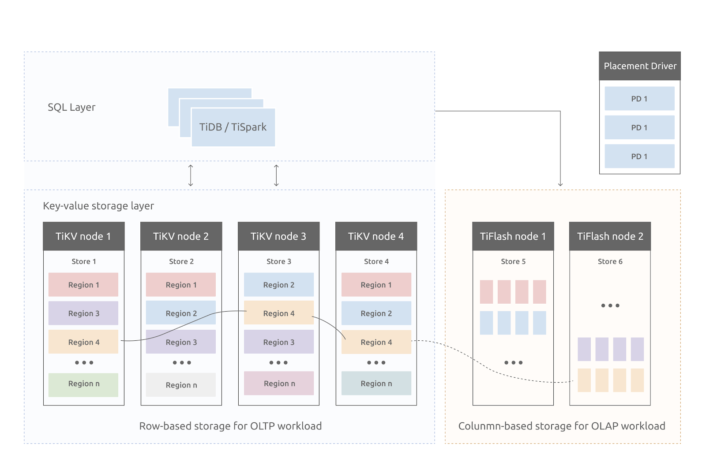

## 一、关系数据库与非关系数据库（NoSQL）

关系数据库和非关系数据库（NoSQL）是两种不同类型的数据库管理系统。

- 关系数据库是基于关系模型的数据库管理系统，其中数据存储在表中，并且表之间可以建立关系。关系数据库使用结构化查询语言（SQL）来查询和管理数据。

- 非关系数据库（NoSQL）则不使用传统的表和关系模型。相反，它们使用不同的数据存储技术，如文档、键值、列族和图形等。非关系数据库旨在提供更高的可伸缩性、更高的性能和更好的可用性。

## 事务的 ACID 特性

ACID 是数据库管理系统（DBMS）中事务处理的四个基本特性的缩写。这四个特性分别为：

- **原子性（Atomicity）**  
  事务是一个不可分割的操作单元，要么全部执行，要么全部不执行。如果事务执行失败，则所有操作都被回滚到事务开始前的状态，保证数据的一致性。
  :::caution
  **注意事务失败并不会自动`ROLLBACK`**需要手动检测 `SQLEXCEPTION`，然后将事务 `ROLLBACK` 到某个 `SAVEPOINT` 或者直接 `ROLLBACK` 整个事务
  :::
- **一致性（Consistency）**  
  事务执行前后，数据库都必须保持一致性状态。即，事务执行前的数据状态必须满足所有的完整性约束（如主键、外键、唯一性等），执行后也必须满足。
- **隔离性（Isolation）**  
  并发执行的多个事务之间相互隔离，每个事务不受其他事务的干扰。即，每个事务看到的数据必须是一个一致性状态，不会受到其他事务未提交的修改的影响。
  - 隔离性是指为了避免并发事务的线程安全问题引入的锁机制以及各种并发安全控制机制
  - 为了平衡性能与隔离性，定义了以下四个隔离级别（可以说是**适当的破坏一致性来提升性能与并行度**）：
    - Read Uncommitted
    - Read Committed
    - Repeatable Read
    - Serializable（所有的事务操作都必须串行操作，完全隔离）
  MySQL 的 innoDB 引擎默认的隔离级别为 Repeatable Read，而 SQL Server、PostgrelSQL、Oracle 默认隔离级别为 Read Committed。
- **持久性（Durability）**  
  一旦事务成功执行，它所作的更改就会一直存在于数据库中，不会丢失。
## 事务的状态

因为事务具有原子性，所以从远处看的话，事务就是密不可分的一个整体，事务的状态也只有三种：Active、Commited 和 Failed，事务要不就在执行中，要不然就是成功或者失败的状态。

但是如果放大来看，我们会发现事务不再是原子的，其中包括了很多中间状态，比如部分提交，事务的状态图也变得越来越复杂。

```img
           +-----------------+    +--------+
     +----->artially Commited+---->Commited|
     |     +-----------------+    +--------+
+------+
|Active|
+------+
     |     +------+               +-------+
     +----->Failed+--------------->Aborted|
           +------+               +-------+
```
- Active：事务的初始状态，表示事务正在执行；
- Partially Commited：在最后一条语句执行之后；
- Failed：发现事务无法正常执行之后；
- Aborted：事务被回滚并且数据库恢复到了事务进行之前的状态之后；
- Commited：成功执行整个事务；
## 行数据库 vs 列数据库

列式数据库和传统的行式数据库在存贮数据时的方式是大相径庭的。在行式数据库中，你可以认为**每一行存贮的内容就是硬盘中的一组连续的字节**。

在传统的行式数据库系统中，数据按如下顺序存储：


| Row | WatchID | JavaEnable | Title | GoodEvent | EventTime |
| --- | --- | --- | --- | --- | --- |
| #0 | 89354350662 | 1 | Investor Relations | 1 | 2016-05-18 05:19:20 |
| #1 | 90329509958 | 0 | Contact us | 1 | 2016-05-18 08:10:20 |
| #2 | 89953706054 | 1 | Mission | 1 | 2016-05-18 07:38:00 |
| #N | … | … | … | … | … |

在列式数据库系统中，数据按如下的顺序存储：


| Row: | #0 | #1 | #2 | #N |
| --- | --- | --- | --- | --- |
| WatchID: | 89354350662 | 90329509958 | 89953706054 | … |
| JavaEnable: | 1 | 0 | 1 | … |
| Title: | Investor Relations | Contact us | Mission | … |
| GoodEvent: | 1 | 1 | 1 | … |
| EventTime: | 2016-05-18 05:19:20 | 2016-05-18 08:10:20 | 2016-05-18 07:38:00 | … |


当数据库调用它们时，它们会被放到内存中。如果你使用的是行式数据库，那么你对一行数据进行操作时，数据库的性能会是最好的。

如果你的数据库是基于行的，你想要在所有数据的某一列上来做一些操作，这就意味着你将花费时间去访问每一行，可你用到的数据仅是一行中的小部分数据。你又必须要读取大量的列来获取所有的数据。如下图：


若此时你使用了列式的数据库，那就可以方便快捷的获取数据，因为每一列的信息都是存储在一起的。如下图：


单纯给列式存储的表加索引，也不能使 OLTP 很高效。行信息分散在很多存储页中。即使整个数据库都存放在内存里，也需要消耗大量的 CPU 资源，来将一行中的所有列拼接起来。

:::tip 名词解释
- 数据库索引
  通常被放置在内存中以提高查询性能。当查询需要使用索引时，数据库会将索引加载到内存中，这样可以避免从硬盘中读取数据，从而加快查询速度。）

- 数据库投影（projection）
  指的是从一个关系中选择特定属性，生成一个新的关系的操作。在SQL中，使用SELECT语句进行投影操作。投影操作可以用于提取所需数据，减少数据冗余，简化数据结构等目的。例如，从一个包含学生信息的表中，只选择出学生姓名和成绩两个属性，生成一个新的只包含这两个属性的表，这就是一个投影操作。
:::


在选择使用哪种数据库时，当核心业务是 OLTP 时，一个行式的数据库，可能是最好的选择。如果你的企业并不需要快速处理OLTP 业务，但需要可以快速处理 OLAP 时，那么一个列式的数据库将会成为你的不二选择。


## HTAP 
- https://www.pingcap.com/blog/technical-paths-to-htap-greenplum-and-tidb-as-examples/
- https://www.ibm.com/topics/olap
- https://www.ibm.com/cloud/blog/olap-vs-oltp
- https://www.pingcap.com/blog/real-world-htap-a-look-at-tidb-and-singlestore-and-their-architectures/

几十年来，联机事务处理 (OLTP) 和联机分析处理 (OLAP) 数据库一直是数据基础架构的规范。OLTP 数据库处理事务数据处理。OLAP 数据库根据通过提取、转换和加载 (ETL) 从 OLTP 数据库导入的数据来处理分析查询。然而，这种OLTP+ETL+OLAP的解决方案成本高昂且复杂，无法满足随着业务增长更及时地获取最新数据分析的需求。

混合事务和分析处理 (HTAP) 数据库是救援解决方案，它在同一架构中处理 OLTP 和 OLAP 工作负载。使用HTAP，几乎可以在交易生效后立即进行数据分析和查询，交易数据和分析实时保持强一致性。 

HTAP 在 2014 年由 Gartner 创造为流行词，但由于技术挑战，HTAP 并未真正流行起来。不过最近，随着GreenPlum、TiDB、AlloyDB、UniStore等现代架构设计的出现，HTAP似乎开始兴起。

**HTAP 的技术路径**
HTAP 数据库在同一个数据库中结合了 OLTP 和 OLAP 功能。技术路线其实很简单，要么在OLAP数据库上扩展事务处理能力，要么在OLTP数据库上扩展分析处理能力。
Greenplum 和 TiDB 就是典型的例子。

**从 OLAP 扩展而来的 HTAP**
OLAP数据库处理一次写入多次读取，重点是扫描查询能力。OLAP 数据库主要使用列式存储，还有其他关键技术，如大规模并行处理 (MPP) 和向量计算。但是，处理高性能事务需要频繁且快速地访问行中的数据。列式存储引擎不是为此而设计的。为基于列的 OLAP 数据库提供 

HTAP能力，数据库必须同时支持批量列式存储和单行高并发修改和查询。

**从 OLTP 扩展而来的 HTAP**
OLTP 数据库专为事务处理而设计。依托行存储、高并发控制、容灾等技术，擅长处理小数据的并发批量写入，重点关注如何快速定位并写入给定的数据行。但是，要对基于行的OLTP数据库进行高性能的分析查询，数据库必须支持对海量数据和特定字段的聚合关联等复杂计算。行存储引擎不是为此设计的。将 OLTP 数据库转换为 HTAP 数据库的最大挑战是如何处理对大量基于行的数据的复杂查询。

**OLAP 扩展的 HTAP：以 Greenplum 为例**

Greenplum 是建立在无共享架构上的 MPP OLAP 数据库。 

Greenplum 6.0主要通过多格式存储增强了其OLTP能力。

Greenplum分别为冷数据或热数据提供了多种存储格式支持。它还通过逻辑分区表为最终用户提供单表访问接口。但是，为了提高OLTP性能，需要频繁更改的数据存储在行存储中。在某些方面，这削弱了行存储格式数据转换为列存储之前的分析性能。
[](GreenPlum中的多种存储格式)

**OLTP 扩展的 HTAP：以 TiDB 为例**
由于使用了MPP技术，集群在扩容时需要重新分配数据。如果数据量很大，这可能需要很长时间。

TiDB 是一个开源的分布式 SQL 数据库，具有强一致性、分布式事务、水平扩展和 MySQL 兼容性。

在 TiDB 5.0 之前，它是一个典型的 OLTP 数据库。然后引入TiFlash引擎，全面转型为HTAP数据库。TiFlash 是 TiDB 的行存储 TiKV 的列存储扩展。TiFlash 既提供了良好的隔离级别又保证了强一致性。 

TiDB 扩展了 Raft 协议，将行格式的事务数据转换为列格式。它存储在 TiFlash 中以支持对交易数据的快速分析查询。数据有行格式和列格式两种，TiDB 可以同时处理 OLAP 和 OLTP。与 GreenPlum 不同，它没有对冷热数据进行区分处理。因此，所有数据的性能是一致的。然而，TiDB 的 HTAP 功能的一个明显成本是更多的存储空间。

[](TiDB的HTAP架构)

此外，得益于基于 Raft 的一致性协议，TiDB 可以扩展到数百个节点。扩容过程中，系统会自动重新分配数据，服务保持不变。

比较 Greenplum 和 TiDB


## 值得了解的数据库
- OLAP
  - ClickHouse
  - Snowflake
  - Druid
  - ElasticSearch
- HTAP
  - TiDB
  - PostgreSQL
- 键值数据库
  - Redis
  - Etcd
  - 底层数据库：boltdb/rocksdb/leveldb
- 文档数据库
  - MongoDB 目前最为流行的NoSQL数据库，它是一种面向集合，模式无关的文档型数据库
- 时序数据库
  - VictoriaMetrics
  - Prometheus
- 图数据库
  - [dgraph](https://github.com/dgraph-io/dgraph)

## 文章
- https://ibmsystemsmag.blogs.com/you_and_i/db2/
- [『浅入深出』MySQL 中事务的实现](https://draveness.me/mysql-transaction)
- [京东如何使用Vitess管理超大规模数据库](https://www.cncf.io/case-studies-cn/jd-com-vitess/)
- [Why This MySQL Alternative Beats Vitess and CRDB in Scaling Out Our Databases on K8s](https://www.pingcap.com/case-study/choose-a-mysql-alternative-over-vitess-and-crdb-to-scale-out-our-databases-on-k8s/)


>TiDB/CockroachDB/Vitess 值得关注
